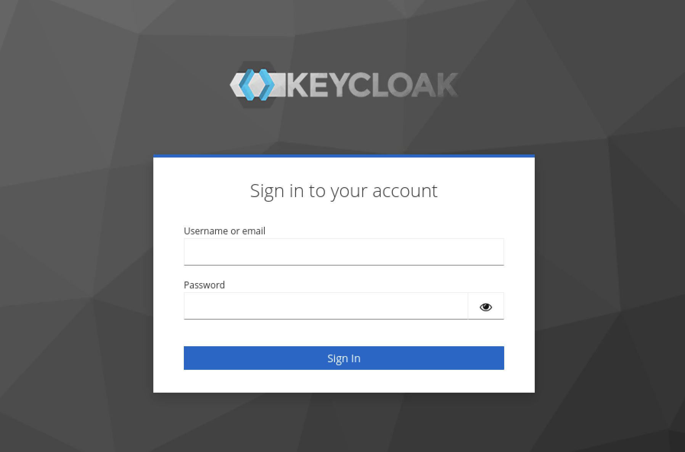
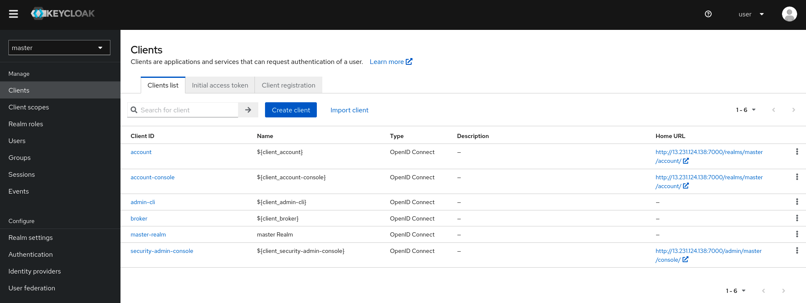
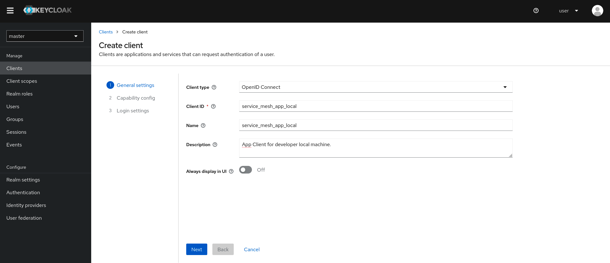
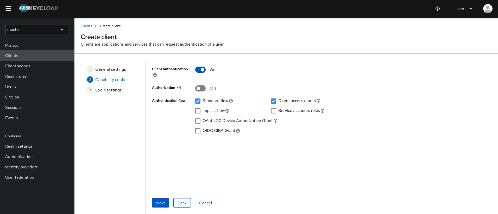
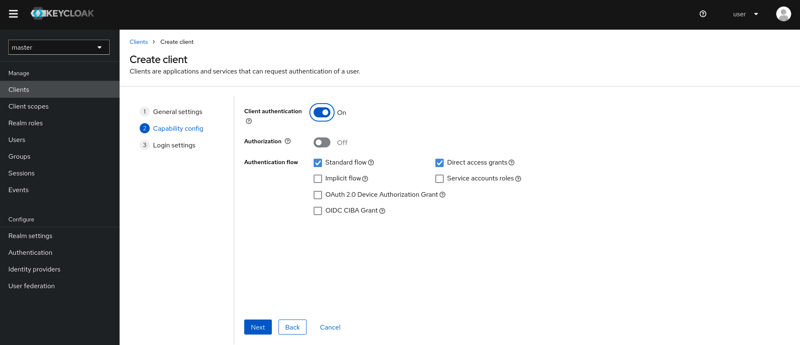
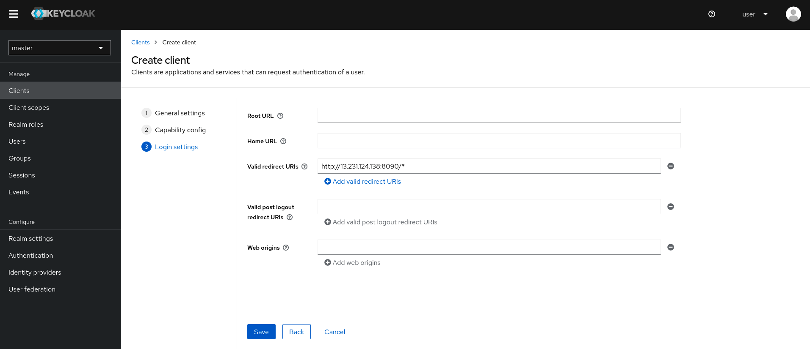
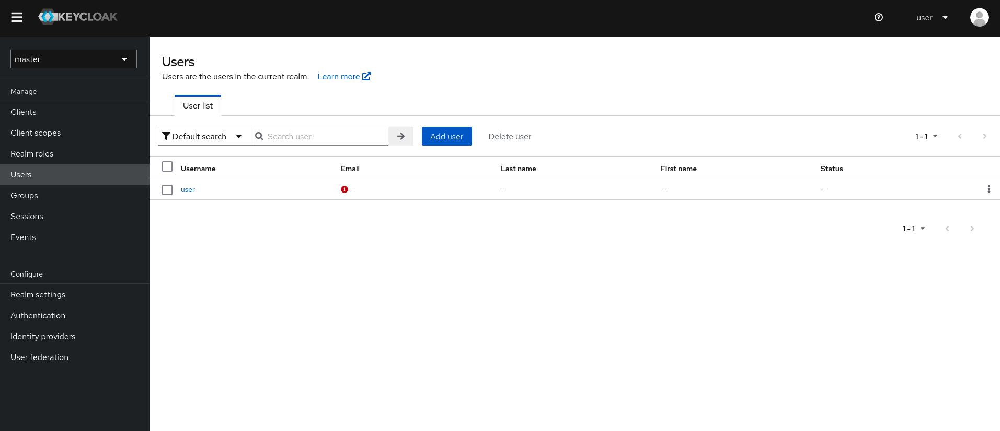
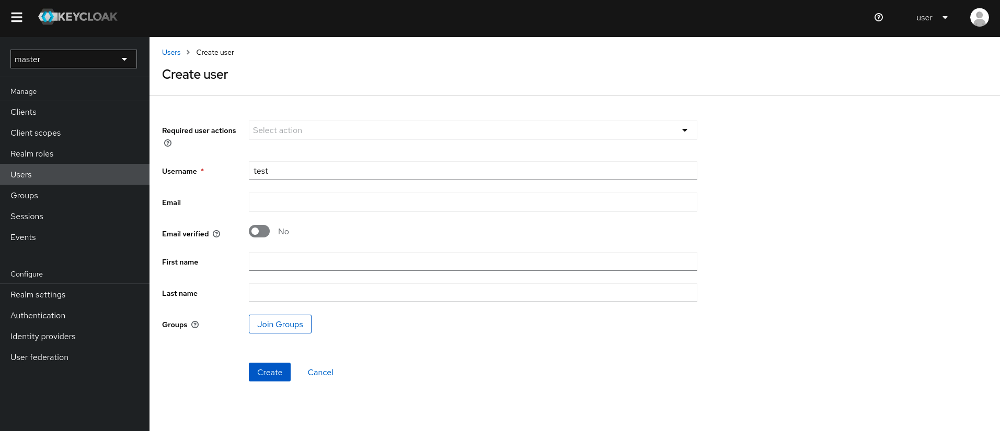

#### アプリケーション環境の構築

- PostgreSQL環境の構築

以下のようなPVCおよびPostgreSQLのサービスのマニフェストを作成し、実行する。

-- postgres-pvc.yaml

```yaml
apiVersion: v1
kind: PersistentVolumeClaim
metadata:
  name: postgres-pvc
spec:
  storageClassName: microk8s-hostpath
  accessModes:
    - "ReadWriteOnce"
  resources:
    requests:
      storage: 1Gi

```

-- postgres.yaml

```yaml
apiVersion: v1
kind: Service
metadata:
  name: postgres
spec:
  type: NodePort
  ports:
    - name: postgres-port
      port: 5432
      targetPort: 5432
      nodePort: 30432
      protocol: TCP
  selector:
    infra: postgres

---
apiVersion: apps/v1
kind: Deployment
metadata:
  name: postgres
spec:
  replicas: 1
  selector:
    matchLabels:
      infra: postgres
  template:
    metadata:
      labels:
        infra: postgres
    spec:
      containers:
        - name: postgres
          image: postgres:11
          env:
            - name: POSTGRES_USER
              value: postgres
            - name: POSTGRES_PASSWORD
              value: postgres
            - name: POSTGRES_DB
              value: sample_database
            - name: PGDATA
              value: /var/lib/postgresql/data/pgdata
          ports:
            - containerPort: 5432
          volumeMounts:
            - mountPath: /var/lib/postgresql/data
              name: pg-data
      volumes:
        - name: pg-data
          persistentVolumeClaim:
            claimName: postgres-pvc

```

```bash
$ microk8s kubectl apply -f postgres-pvc.yml
persistentvolumeclaim/postgres-pvc created

$ microk8s kubectl apply -f postgres.yml
service/postgres created
deployment.apps/postgres created

$ microk8s kubectl describe pvc postgres-pvc
Name:          postgres-pvc
Namespace:     default
StorageClass:  microk8s-hostpath
Status:        Bound
Volume:        pvc-b083660c-2181-408b-9e85-aea61812e53e
Labels:        <none>
Annotations:   pv.kubernetes.io/bind-completed: yes
               pv.kubernetes.io/bound-by-controller: yes
               volume.beta.kubernetes.io/storage-provisioner: microk8s.io/hostpath
               volume.kubernetes.io/selected-node: ip-172-7-1-239.ap-northeast-1.compute.internal
               volume.kubernetes.io/storage-provisioner: microk8s.io/hostpath
Finalizers:    [kubernetes.io/pvc-protection]
Capacity:      1Gi
Access Modes:  RWO
VolumeMode:    Filesystem
Used By:       postgres-7f8c6b8ddf-9j6tx
Events:
  Type    Reason                 Age                     From                                                                                             Message
  ----    ------                 ----                    ----                                                                                             -------
  Normal  WaitForFirstConsumer   2m19s (x24 over 7m52s)  persistentvolume-controller                                                                      waiting for firstconsumer to be created before binding
  Normal  ExternalProvisioning   2m4s (x2 over 2m4s)     persistentvolume-controller                                                                      Waiting for a volume to be created either by the external provisioner 'microk8s.io/hostpath' or manually by the system administrator. If volume creation is delayed, please verify that the provisioner is running and correctly registered.
  Normal  Provisioning           2m4s                    microk8s.io/hostpath_hostpath-provisioner-7c8bdf94b8-s4b45_b7098777-e57b-4ab6-be2c-e8683cd98739  External provisioner is provisioning volume for claim "default/postgres-pvc"
  Normal  ProvisioningSucceeded  114s                    microk8s.io/hostpath_hostpath-provisioner-7c8bdf94b8-s4b45_b7098777-e57b-4ab6-be2c-e8683cd98739  Successfully provisioned volume pvc-b083660c-2181-408b-9e85-aea61812e53e

$ microk8s kubectl describe deployment postgres
  Name:                   postgres
  Namespace:              default
  CreationTimestamp:      Sat, 27 Jul 2024 18:11:08 +0000
  Labels:                 <none>
  Annotations:            deployment.kubernetes.io/revision: 1
  Selector:               infra=postgres
  Replicas:               1 desired | 1 updated | 1 total | 1 available | 0 unavailable
  StrategyType:           RollingUpdate
  MinReadySeconds:        0
  RollingUpdateStrategy:  25% max unavailable, 25% max surge
  Pod Template:
    Labels:  infra=postgres
    Containers:
     postgres:
      Image:      postgres:11
      Port:       5432/TCP
      Host Port:  0/TCP
      Environment:
        POSTGRES_USER:      postgres
        POSTGRES_PASSWORD:  postgres
        POSTGRES_DB:        sample_database
        PGDATA:             /var/lib/postgresql/data/pgdata
      Mounts:
        /var/lib/postgresql/data from pg-data (rw)
    Volumes:
     pg-data:
      Type:          PersistentVolumeClaim (a reference to a PersistentVolumeClaim in the same namespace)
      ClaimName:     postgres-pvc
      ReadOnly:      false
    Node-Selectors:  <none>
    Tolerations:     <none>
  Conditions:
    Type           Status  Reason
    ----           ------  ------
    Available      True    MinimumReplicasAvailable
    Progressing    True    NewReplicaSetAvailable
  OldReplicaSets:  <none>
  NewReplicaSet:   postgres-7f8c6b8ddf (1/1 replicas created)
  Events:
    Type    Reason             Age   From                   Message
    ----    ------             ----  ----                   -------
    Normal  ScalingReplicaSet  5m4s  deployment-controller  Scaled up replica set postgres-7f8c6b8ddf to 1

$ export postgres_pod_name=`microk8s kubectl get pods -o custom-columns=:.metadata.name -l infra=postgres`
$ microk8s kubectl exec $postgres_pod_name -- psql -U postgres -d sample_database -c "select * from information_schema.tables;"

```

**NOTE:** データベース作成後は以下のコマンドでSQLを発行することができる。

```bash
$ export postgres_pod_name=`microk8s kubectl get pods -o custom-columns=:.metadata.name -l infra=postgres`
$ microk8s kubectl exec $postgres_pod_name -- psql -U postgres -d sample_database -c "select * from information_schema.tables;"

```

- Keycloakの構築

**NOTE:** Keycloak構築後に開発端末からブラウザでコンソール操作を行う。HTTPアクセスは7000->80でポートフォワードするので、Kubernetesクラスタが構築されたEC2インスタンスのセキュリティグループ設定で、開発端末からのポート7000番のインバウンド許可を実施しておくこと。

```yaml
SecurityGroupIngressEC2:
  Type: AWS::EC2::SecurityGroupIngress
  Properties:
    GroupId: !Ref SecurityGroupEC2
    IpProtocol: tcp
    FromPort: 7000
    ToPort: 7000
    CidrIp: XXX.XXX.XXX.XXX/32
```


Helmレポジトリに [bitnami](https://github.com/bitnami/charts/tree/main/bitnami/keycloak) が提供するKeycloakパッケージを追加する。

**NOTE:** 通常だと、2024年時点で最新バージョンの24がインストールされるが、コンソールログインでHTTPSが必須となるので、ここでは簡易化のために以前のバージョンを指定して行う。 See: https://github.com/keycloak/keycloak/issues/24821 / https://hub.docker.com/r/bitnami/keycloak/tags/?page=2&page_size=&ordering=&name=23

```bash
$ microk8s helm3 repo add bitnami https://charts.bitnami.com/bitnami
"bitnami" has been added to your repositories

$ microk8s helm3 install keycloak-23 bitnami/keycloak --set image.tag=23.0.6-debian-11-r13
NAME: keycloak-23
LAST DEPLOYED: Sun Jul 28 18:35:48 2024
NAMESPACE: default
STATUS: deployed
REVISION: 1
TEST SUITE: None
NOTES:
CHART NAME: keycloak
CHART VERSION: 21.8.0
APP VERSION: 24.0.5

** Please be patient while the chart is being deployed **

Keycloak can be accessed through the following DNS name from within your cluster:

    keycloak-23.default.svc.cluster.local (port 80)

To access Keycloak from outside the cluster execute the following commands:

1. Get the Keycloak URL by running these commands:

    export HTTP_SERVICE_PORT=$(kubectl get --namespace default -o jsonpath="{.spec.ports[?(@.name=='http')].port}" services keycloak-23)
    kubectl port-forward --namespace default svc/keycloak-23 ${HTTP_SERVICE_PORT}:${HTTP_SERVICE_PORT} &

    echo "http://127.0.0.1:${HTTP_SERVICE_PORT}/"

2. Access Keycloak using the obtained URL.

WARNING: There are "resources" sections in the chart not set. Using "resourcesPreset" is not recommended for production. For production installations, please set the following values according to your workload needs:
  - resources
+info https://kubernetes.io/docs/concepts/configuration/manage-resources-containers/

⚠ SECURITY WARNING: Original containers have been substituted. This Helm chart was designed, tested, and validated on multiple platforms usinga specific set of Bitnami and Tanzu Application Catalog containers. Substituting other containers is likely to cause degraded security and performance, broken chart features, and missing environment variables.

Substituted images detected:
  - docker.io/bitnami/keycloak:23.0.6-debian-11-r13

  $ microk8s kubectl get all --all-namespaces
  NAMESPACE        NAME                                                  READY   STATUS    RESTARTS   AGE
  default          pod/keycloak-23-0                                     1/1     Running   0          83s
  default          pod/keycloak-23-postgresql-0                          1/1     Running   0          83s
  default          pod/postgres-7f8c6b8ddf-9j6tx                         1/1     Running   0          24h
  default          pod/sample-kubernetes-dbaccess-app-6f6dc66cb7-glbwj   1/1     Running   0          10h
  kube-system      pod/calico-kube-controllers-796fb75cc-lh9kb           1/1     Running   0          3d19h
  kube-system      pod/calico-node-cqfrg                                 1/1     Running   0          3d19h
  kube-system      pod/coredns-5986966c54-2fm58                          1/1     Running   0          3d19h
  kube-system      pod/hostpath-provisioner-7c8bdf94b8-s4b45             1/1     Running   0          27h
  metallb-system   pod/controller-5484c5f99f-xlcsf                       1/1     Running   0          21h
  metallb-system   pod/speaker-2vpvq                                     1/1     Running   0          21h

  NAMESPACE        NAME                                        TYPE           CLUSTER-IP       EXTERNAL-IP   PORT(S)                  AGE
  default          service/keycloak-23                         ClusterIP      10.152.183.67    <none>        80/TCP                   83s
  default          service/keycloak-23-headless                ClusterIP      None             <none>        8080/TCP                 83s
  default          service/keycloak-23-postgresql              ClusterIP      10.152.183.227   <none>        5432/TCP                 83s
  default          service/keycloak-23-postgresql-hl           ClusterIP      None             <none>        5432/TCP                 83s
  default          service/kubernetes                          ClusterIP      10.152.183.1     <none>        443/TCP                  3d19h
  default          service/postgres                            NodePort       10.152.183.56    <none>        5432:30432/TCP           24h
  default          service/sample-kubernetes-dbaccess-app      ClusterIP      10.152.183.180   <none>        8080/TCP                 10h
  default          service/sample-kubernetes-dbaccess-app-lb   LoadBalancer   10.152.183.196   192.168.1.0   8080:31570/TCP           9h
  kube-system      service/kube-dns                            ClusterIP      10.152.183.10    <none>        53/UDP,53/TCP,9153/TCP   3d19h
  metallb-system   service/webhook-service                     ClusterIP      10.152.183.57    <none>        443/TCP                  21h

  NAMESPACE        NAME                         DESIRED   CURRENT   READY   UP-TO-DATE   AVAILABLE   NODE SELECTOR            AGE
  kube-system      daemonset.apps/calico-node   1         1         1       1            1           kubernetes.io/os=linux   3d19h
  metallb-system   daemonset.apps/speaker       1         1         1       1            1           kubernetes.io/os=linux   21h

  NAMESPACE        NAME                                             READY   UP-TO-DATE   AVAILABLE   AGE
  default          deployment.apps/postgres                         1/1     1            1           24h
  default          deployment.apps/sample-kubernetes-dbaccess-app   1/1     1            1           10h
  kube-system      deployment.apps/calico-kube-controllers          1/1     1            1           3d19h
  kube-system      deployment.apps/coredns                          1/1     1            1           3d19h
  kube-system      deployment.apps/hostpath-provisioner             1/1     1            1           27h
  metallb-system   deployment.apps/controller                       1/1     1            1           21h

  NAMESPACE        NAME                                                        DESIRED   CURRENT   READY   AGE
  default          replicaset.apps/postgres-7f8c6b8ddf                         1         1         1       24h
  default          replicaset.apps/sample-kubernetes-dbaccess-app-6f6dc66cb7   1         1         1       10h
  kube-system      replicaset.apps/calico-kube-controllers-796fb75cc           1         1         1       3d19h
  kube-system      replicaset.apps/coredns-5986966c54                          1         1         1       3d19h
  kube-system      replicaset.apps/hostpath-provisioner-7c8bdf94b8             1         1         1       27h
  metallb-system   replicaset.apps/controller-5484c5f99f                       1         1         1       21h

  NAMESPACE   NAME                                      READY   AGE
  default     statefulset.apps/keycloak-23              1/1     83s
  default     statefulset.apps/keycloak-23-postgresql   1/1     83s

```

KeycloakのAdminのパスワードを取得する。

```bash
$ microk8s kubectl get secret --namespace default keycloak-23 -o jsonpath="{.data.admin-password}" | base64 --decode
xxxxxxxxxx
```
**NOTE:** 表示されるAdminのパスワードは後ほどログインで使用する。

MicroK8sクラスタ内に構築されたKeycloakコンソール画面へ開発端末からアクセスするためにポートフォワードする。

```bash
$ microk8s kubectl port-forward service/keycloak-23 7000:80 --address 0.0.0.0 &
Forwarding from 0.0.0.0:7000 -> 8080
```

MicroK8sクラスタへのインバウンド接続が許可された開発端末から、ブラウザで「http://xxx.xxx.xxx.xxx:7000」へアクセスする(xxx.xxx.xxx.xxxは、MicroK8sクラスタのIPアドレス)。



ユーザ：user / パスワード：上記で取得したパスワード

- アプリクライアントの作成

ログイン後、「Clients」メニューからアプリクライアントの登録を行う。



「Create Client」ボタンを押下し、開発端末のLocalで動くアプリクライアントと、クラスタ内で実行されるDev用のアプリクライアントの２種類を作成する。

[Local向けアプリクライアントの作成時に必要な必須属性(他の項目は任意)]

* Client type : OpenID Connect
* Client ID : service_mesh_app_local
* Client authentication : on
* Authentication flow : Standard flow / Direct access grants
* Valid redirect URIs : http://localhost:8080/*





[Dev向けアプリクライアントの作成時に必要な必須属性(他の項目は任意)]

* Client type : OpenID Connect
* Client ID : service_mesh_app_dev
* Client authentication : on
* Authentication flow : Standard flow / Direct access grants
* Valid redirect URIs : http://xxx.xxx.xxx.xxx:8090/* (xxx.xxx.xxx.xxxは、MicroK8sクラスタのIPアドレス)





- テストユーザの作成

アプリケーションのユーザを作成する。「Users」メニューから、「Add user」を選択する。

[アプリケーションのユーザの作成時に必要な必須属性(他の項目は任意)]

* Username : test




**NOTE:** アプリクライアントのクレデンシャルをAP実装時に取得する。

- Apache Kafkaの構築

KubernetesにおけるKafka Operatorである [Strimzi](https://github.com/strimzi)を使ってApache Kafkaの環境を構築する。
Namespaceを作成し、Strimziを使ってKafkaをインストールする。

kafka/namespace.yml
```yaml
apiVersion: v1
kind: Namespace
metadata:
  name: kafka
```

```bash
$ microk8s kubectl create -f namespace.yml
namespace/kafka created

$ microk8s kubectl create -f 'https://strimzi.io/install/latest?namespace=kafka' -n kafka
clusterrole.rbac.authorization.k8s.io/strimzi-cluster-operator-namespaced created
customresourcedefinition.apiextensions.k8s.io/kafkamirrormakers.kafka.strimzi.io created
customresourcedefinition.apiextensions.k8s.io/kafkaconnectors.kafka.strimzi.io created
clusterrole.rbac.authorization.k8s.io/strimzi-kafka-broker created
clusterrole.rbac.authorization.k8s.io/strimzi-cluster-operator-global created
customresourcedefinition.apiextensions.k8s.io/kafkatopics.kafka.strimzi.io created
configmap/strimzi-cluster-operator created
clusterrolebinding.rbac.authorization.k8s.io/strimzi-cluster-operator created
customresourcedefinition.apiextensions.k8s.io/kafkaconnects.kafka.strimzi.io created
customresourcedefinition.apiextensions.k8s.io/kafkabridges.kafka.strimzi.io created
rolebinding.rbac.authorization.k8s.io/strimzi-cluster-operator created
clusterrolebinding.rbac.authorization.k8s.io/strimzi-cluster-operator-kafka-broker-delegation created
clusterrole.rbac.authorization.k8s.io/strimzi-cluster-operator-leader-election created
deployment.apps/strimzi-cluster-operator created
customresourcedefinition.apiextensions.k8s.io/strimzipodsets.core.strimzi.io created
clusterrolebinding.rbac.authorization.k8s.io/strimzi-cluster-operator-kafka-client-delegation created
customresourcedefinition.apiextensions.k8s.io/kafkausers.kafka.strimzi.io created
customresourcedefinition.apiextensions.k8s.io/kafkas.kafka.strimzi.io created
serviceaccount/strimzi-cluster-operator created
rolebinding.rbac.authorization.k8s.io/strimzi-cluster-operator-entity-operator-delegation created
rolebinding.rbac.authorization.k8s.io/strimzi-cluster-operator-watched created
customresourcedefinition.apiextensions.k8s.io/kafkarebalances.kafka.strimzi.io created
customresourcedefinition.apiextensions.k8s.io/kafkanodepools.kafka.strimzi.io created
clusterrole.rbac.authorization.k8s.io/strimzi-cluster-operator-watched created
clusterrole.rbac.authorization.k8s.io/strimzi-kafka-client created
clusterrole.rbac.authorization.k8s.io/strimzi-entity-operator created
rolebinding.rbac.authorization.k8s.io/strimzi-cluster-operator-leader-election created
customresourcedefinition.apiextensions.k8s.io/kafkamirrormaker2s.kafka.strimzi.io created

$ microk8s kubectl get all -n kafka
NAME                                            READY   STATUS    RESTARTS   AGE
pod/strimzi-cluster-operator-6948497896-4wfdj   1/1     Running   0          22m

NAME                                       READY   UP-TO-DATE   AVAILABLE   AGE
deployment.apps/strimzi-cluster-operator   1/1     1            1           22m

NAME                                                  DESIRED   CURRENT   READY   AGE
replicaset.apps/strimzi-cluster-operator-6948497896   1         1         1       22m
```

続いて、Operatorを経由して、PartitionやTopicを構成する。以下のようなマニュフェストファイルを構成し、実行する。
See : https://strimzi.io/docs/operators/latest/deploying

kafka/kafka.yml

**NOTE:** kafkaのバージョンやプロトコルバージョンは最新ドキュメントのものと同期をとること。

**NOTE:** AdvertiseHostには、クラスタのパブリックIPを指定する。Kubernetesクラスタ外のアプリケーションからアクセスする際に利用する。

```yaml
apiVersion: kafka.strimzi.io/v1beta2
kind: Kafka
metadata:
  name: sample-cluster
spec:
  kafka:
    version: 3.7.1
    replicas: 1
    listeners:
      - name: plain
        port: 9092
        type: internal
        tls: false
      - name: tls
        port: 9093
        type: internal
        tls: true
      - name: external
        port: 9094
        type: loadbalancer
        tls: false
        configuration:
          brokers:
            - broker: 0
              advertisedHost: XXX.XXX.XXX.XXX
              advertisedPort: 9094
    config:
      offsets.topic.replication.factor: 1
      transaction.state.log.replication.factor: 1
      transaction.state.log.min.isr: 1
      default.replication.factor: 1
      min.insync.replicas: 1
      inter.broker.protocol.version: "3.7"
    storage:
      type: jbod
      volumes:
        - id: 0
          type: persistent-claim
          size: 10Gi
          deleteClaim: false
  zookeeper:
    replicas: 1
    storage:
      type: persistent-claim
      size: 10Gi
      deleteClaim: false
  entityOperator:
    topicOperator: {}
    userOperator: {}
---
apiVersion: kafka.strimzi.io/v1beta2
kind: KafkaTopic
metadata:
  name: sample-topic
  labels:
    strimzi.io/cluster: sample-cluster
spec:
  partitions: 3
  replicas: 1
```


```bash
$ microk8s kubectl apply -f kafka.yml -n kafka
kafka.kafka.strimzi.io/sample-cluster created
kafkatopic.kafka.strimzi.io/sample-topic created

$ microk8s kubectl get all -n kafka
NAME                                                 READY   STATUS    RESTARTS   AGE
pod/sample-cluster-entity-operator-dbdbbcb78-46ss8   2/2     Running   0          15m
pod/sample-cluster-kafka-0                           1/1     Running   0          15m
pod/sample-cluster-zookeeper-0                       1/1     Running   0          16m
pod/strimzi-cluster-operator-6948497896-4wfdj        1/1     Running   0          6d23h

NAME                                              TYPE           CLUSTER-IP       EXTERNAL-IP   PORT(S)                                        AGE
service/sample-cluster-kafka-0                    LoadBalancer   10.152.183.95    192.168.1.2   9094:31141/TCP                                 15m
service/sample-cluster-kafka-bootstrap            ClusterIP      10.152.183.165   <none>        9091/TCP,9092/TCP,9093/TCP                     15m
service/sample-cluster-kafka-brokers              ClusterIP      None             <none>        9090/TCP,9091/TCP,8443/TCP,9092/TCP,9093/TCP   15m
service/sample-cluster-kafka-external-bootstrap   LoadBalancer   10.152.183.70    192.168.1.1   9094:30113/TCP                                 15m
service/sample-cluster-zookeeper-client           ClusterIP      10.152.183.45    <none>        2181/TCP                                       16m
service/sample-cluster-zookeeper-nodes            ClusterIP      None             <none>        2181/TCP,2888/TCP,3888/TCP                     16m

NAME                                             READY   UP-TO-DATE   AVAILABLE   AGE
deployment.apps/sample-cluster-entity-operator   1/1     1            1           15m
deployment.apps/strimzi-cluster-operator         1/1     1            1           6d23h

NAME                                                       DESIRED   CURRENT   READY   AGE
replicaset.apps/sample-cluster-entity-operator-dbdbbcb78   1         1         1       15m
replicaset.apps/strimzi-cluster-operator-6948497896        1         1         1       6d23h
```

テストメッセージをProducerコンソールスクリプトを使って送信し、Consumerコンソールスクリプトで受信する。

```bash
$ microk8s kubectl -n kafka run kafka-producer -ti --image=quay.io/strimzi/kafka:0.42.0-kafka-3.7.1 --rm=true --restart=Never-- bin/kafka-console-producer.sh --broker-list sample-cluster-kafka-bootstrap:9092 --topic sample-topic
If you don't see a command prompt, try pressing enter.
>test

$ $ microk8s kubectl -n kafka run kafka-consumer -ti --image=quay.io/strimzi/kafka:0.42.0-kafka-3.7.1 --rm=true --restart=Never-- bin/kafka-console-consumer.sh --bootstrap-server sample-cluster-kafka-bootstrap:9092 --topic sample-topic --from-beginning
If you don't see a command prompt, try pressing enter.
test
```


----
[index]

1. [Set up RHEL EC2 instance on AWS](1-set-up-rhel-instance-on-aws.md)
2. [Set up MicroK8s](2-set-up-microk8s.md)
3. [Set up Application Environment](3-set-up-app-env.md)
4. [Implementation of Application](4-implementation-app.md)
5. [Deploy Application](5-deploy-app.md)
6. [Implementation of Service Mesh Application](6-implementation-service-mesh-app.md)
7. [Deploy Service Mesh Application](7-deploy-service-mesh-app.md)
