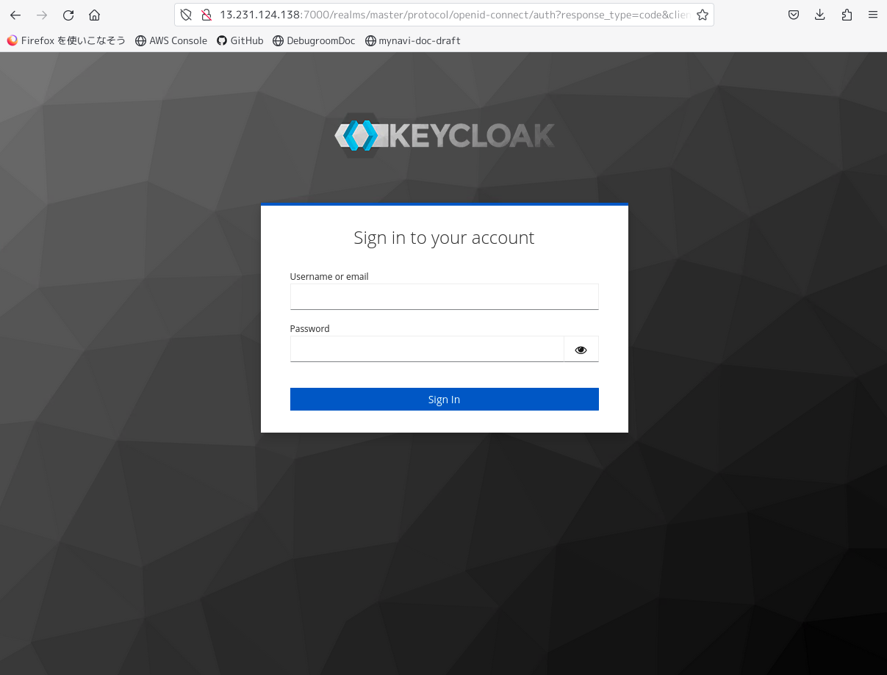
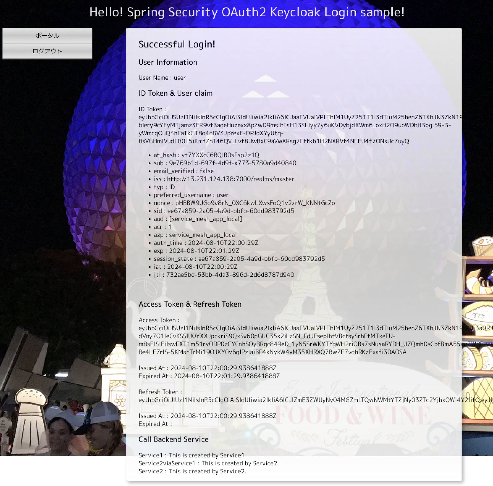

#### サービスメッシュ アプリケーションの実装

- バックエンドサブネット 同期呼び出しされるマイクロサービス(2)の実装

| 動作対象 | バージョン |
| ---- | ---- |
| Java | 21 |
| Spring Boot | 3.3.2 |

以下の処理を実行する、REST APIマイクロサービスアプリケーションを実装する。

1. 別のマイクロサービスから同期呼び出しされるマイクロサービス
2. データベースアクセスし、その結果を返却する

-- pom.xml

以下のライブラリのDependencyを設定する。

Spring MVC / Spring Data JPAを使ったREST APIアプリケーションを実装する。以下のライブラリのDependencyを設定する。
なお、データベースはローカル開発環境ではHSQL、MicroK8sではPostgreSQLを使用する。

1. spring-boot-starter-web
1. spring-boot-starter-data-jpa
1. PostgreSQL
1. HSQL

なお、Kubenetes向けコンテナイメージの作成には、[jKube](https://eclipse.dev/jkube/docs/kubernetes-maven-plugin/)を利用する。kubernetes-maven-pluginのHELM Repositoryには、
[「Set up MicroK8s」で記載したChartmuseum](2-set-up-microk8s.md) のIPアドレスを設定すること。

```xml
<?xml version="1.0" encoding="UTF-8"?>
<project xmlns="http://maven.apache.org/POM/4.0.0" xmlns:xsi="http://www.w3.org/2001/XMLSchema-instance"
         xsi:schemaLocation="http://maven.apache.org/POM/4.0.0 https://maven.apache.org/xsd/maven-4.0.0.xsd">
    <modelVersion>4.0.0</modelVersion>
    <parent>
        <groupId>org.springframework.boot</groupId>
        <artifactId>spring-boot-starter-parent</artifactId>
        <version>3.3.2</version>
        <relativePath/> <!-- lookup parent from repository -->
    </parent>
    <groupId>org.debugroom</groupId>
    <artifactId>service-mesh-app-service2</artifactId>
    <version>0.0.1-SNAPSHOT</version>
    <name>service-mesh-app-service2</name>
    <description>Demo project for Spring Boot</description>
    <properties>
        <java.version>21</java.version>
    </properties>
    <dependencies>
        <dependency>
            <groupId>org.springframework.boot</groupId>
            <artifactId>spring-boot-starter-web</artifactId>
        </dependency>
        <dependency>
            <groupId>org.springframework.boot</groupId>
            <artifactId>spring-boot-starter-data-jpa</artifactId>
        </dependency>
        <dependency>
            <groupId>org.postgresql</groupId>
            <artifactId>postgresql</artifactId>
        </dependency>
        <dependency>
            <groupId>org.hsqldb</groupId>
            <artifactId>hsqldb</artifactId>
            <scope>runtime</scope>
        </dependency>

        <dependency>
            <groupId>org.projectlombok</groupId>
            <artifactId>lombok</artifactId>
            <optional>true</optional>
        </dependency>
        <dependency>
            <groupId>org.springframework.boot</groupId>
            <artifactId>spring-boot-starter-test</artifactId>
            <scope>test</scope>
        </dependency>
    </dependencies>

    <build>
        <plugins>
            <plugin>
                <groupId>org.springframework.boot</groupId>
                <artifactId>spring-boot-maven-plugin</artifactId>
                <configuration>
                    <excludes>
                        <exclude>
                            <groupId>org.projectlombok</groupId>
                            <artifactId>lombok</artifactId>
                        </exclude>
                    </excludes>
                </configuration>
            </plugin>
            <plugin>
                <groupId>org.eclipse.jkube</groupId>
                <artifactId>kubernetes-maven-plugin</artifactId>
                <configuration>
                    <helm>
                        <home>http://localhost:8000</home>
                        <sources>http://localhost:8000</sources>
                        <keywords>service2</keywords>
                        <maintainers>
                            <maintainer>
                                <name>org.debugroom</name>
                                <email>org.debugroom</email>
                            </maintainer>
                        </maintainers>
                        <stableRepository>
                            <name>sample-chartmuseum-snapshot-repository</name>
                            <url>http://localhost:8000/api/charts</url>
                            <username>debugroom</username>
                            <password>debugroom</password>
                            <type>CHARTMUSEUM</type>
                        </stableRepository>
                        <snapshotRepository>
                            <name>sample-chartmuseum-snapshot-repository</name>
                            <url>http://localhost:8000/api/charts</url>
                            <username>debugroom</username>
                            <password>debugroom</password>
                            <type>CHARTMUSEUM</type>
                        </snapshotRepository>
                    </helm>
                </configuration>
                <version>1.4.0</version>
            </plugin>
        </plugins>
    </build>

</project>
```

-- 起動・設定クラス

SpringBoot起動・設定クラスとして以下を作成する。

1. org.debugroom.sample.kubernetes.servicemesh.config.App.java
1. org.debugroom.sample.kubernetes.servicemesh.config.MvcConfig.java
1. org.debugroom.sample.kubernetes.servicemesh.config.DomainConfig.java
1. org.debugroom.sample.kubernetes.servicemesh.config.JpaConfig.java
1. org.debugroom.sample.kubernetes.servicemesh.config.LocalConfig.java

Appでは、アプリケーションの起動処理を実行する。

```java
package org.debugroom.sample.kubernetes.servicemesh.config;

import org.springframework.boot.SpringApplication;
import org.springframework.boot.autoconfigure.SpringBootApplication;

@SpringBootApplication
public class App {

    public static void main(String[] args) {
        SpringApplication.run(App.class, args);
    }

}
```

MvcConfigでは、SpringMvcの設定および、Web層パッケージのコンポーネントスキャン設定を行う。

```java
package org.debugroom.sample.kubernetes.servicemesh.config;

import org.springframework.context.annotation.ComponentScan;
import org.springframework.context.annotation.Configuration;
import org.springframework.web.servlet.config.annotation.WebMvcConfigurer;

@ComponentScan("org.debugroom.sample.kubernetes.servicemesh.app.web")
@Configuration
public class MvcConfig implements WebMvcConfigurer {
}
```

DomainConfigでは、ビジネスドメイン層パッケージのコンポーネントスキャン設定を行う。

```java
package org.debugroom.sample.kubernetes.servicemesh.config;

import org.springframework.context.annotation.ComponentScan;
import org.springframework.context.annotation.Configuration;

@Configuration
@ComponentScan("org.debugroom.sample.kubernetes.servicemesh.domain")
public class DomainConfig {
}
```

JpaConfigでは、JPAおよびSpring Data JPA、RepositoryおよびEntity関連クラスパッケージのコンポーネントスキャン設定を行う。

```java
package org.debugroom.sample.kubernetes.servicemesh.config;

import org.springframework.beans.factory.annotation.Autowired;
import org.springframework.context.annotation.Bean;
import org.springframework.context.annotation.Configuration;
import org.springframework.data.jpa.repository.config.EnableJpaRepositories;
import org.springframework.orm.jpa.JpaTransactionManager;
import org.springframework.orm.jpa.JpaVendorAdapter;
import org.springframework.orm.jpa.LocalContainerEntityManagerFactoryBean;
import org.springframework.orm.jpa.vendor.HibernateJpaVendorAdapter;
import org.springframework.transaction.PlatformTransactionManager;
import org.springframework.transaction.annotation.EnableTransactionManagement;

import javax.sql.DataSource;
import java.util.Properties;

@Configuration
@EnableTransactionManagement
@EnableJpaRepositories(
        basePackages = "org.debugroom.sample.kubernetes.servicemesh.domain.repository"
)
public class JpaConfig {

    @Autowired
    DataSource dataSource;

    @Bean
    public PlatformTransactionManager transactionManager() throws Exception{
        return new JpaTransactionManager();
    }

    @Bean
    public LocalContainerEntityManagerFactoryBean entityManagerFactory() {

        JpaVendorAdapter adapter = new HibernateJpaVendorAdapter();

        Properties properties = new Properties();
        properties.setProperty("hibernate.show_sql", "true");
        properties.setProperty("hibernate.format_sql", "true");

        LocalContainerEntityManagerFactoryBean localContainerEntityManagerFactoryBean
                = new LocalContainerEntityManagerFactoryBean();
        localContainerEntityManagerFactoryBean.setPackagesToScan(
                "org.debugroom.sample.kubernetes.servicemesh.domain.model.entity"
        );
        localContainerEntityManagerFactoryBean.setJpaProperties(properties);
        localContainerEntityManagerFactoryBean.setJpaVendorAdapter(adapter);
        localContainerEntityManagerFactoryBean.setDataSource(dataSource);

        return localContainerEntityManagerFactoryBean;

    }

}
```

LocalConfigでは、HSQLをデータベースとして使用する設定およびプロファイル設定を行う。

```java
package org.debugroom.sample.kubernetes.servicemesh.config;

import org.springframework.context.annotation.Bean;
import org.springframework.context.annotation.Configuration;
import org.springframework.context.annotation.Profile;
import org.springframework.jdbc.datasource.embedded.EmbeddedDatabaseBuilder;
import org.springframework.jdbc.datasource.embedded.EmbeddedDatabaseType;

import javax.sql.DataSource;

@Profile("local")
@Configuration
public class LocalConfig {

    @Bean
    public DataSource dataSource(){
        return (new EmbeddedDatabaseBuilder())
                .setType(EmbeddedDatabaseType.HSQL)
                .addScript("classpath:schema-hsql.sql")
                .addScript("classpath:data-hsql.sql")
                .build();
    }

}

```

設定ファイルでは以下の通り設定する。

デフォルト：application.yml

```yaml
spring:
  profiles:
    active: local
```

プロファイル localでは、開発端末で複数のマイクロサービスを起動するので、起動ポートを変更しておく。

プロファイル local：application-local.yml

```yaml
server:
  port: 8082
```

プロファイル devでは、MicroK8sでデプロイした場合のデータベースアクセスURLを設定する。

プロファイル dev : application-dev.yml

```yaml
spring:
  datasource:
    url: jdbc:postgresql://${DB_URL}/sample_database
    username: postgres
    password: postgres
  sql:
    init:
      mode: always
      schema-locations: classpath*:/schema-postgresql.sql
      data-locations: classpath*:/data-postgresql.sql
```

**NOTE:** MicroK8s環境では、PostgreSQLデータベースに接続するようプロファイルを環境変数およびapplication-xxx.ymlで切り替えて有効化する。

-- Web層向けSpring MVC関連クラス

Web層向けのSpring MVC関連クラスとして以下を作成する。

1. org.debugroom.sample.kubernetes.servicemesh.app.web.SampleController.java

SampleControllerでは、以下のREST APIを定義し、必要に応じてドメイン層のサービスクラスやレポジトリクラスを呼び出す。

**NOTE:** 基本的に返却するためのDTOクラスを作成し、マッパーで変換してJSON形式で返却するのが望ましいが、ここでは簡易的にエンティティクラスを直接返却している。

```java
package org.debugroom.sample.kubernetes.servicemesh.app.web;

import org.debugroom.sample.kubernetes.servicemesh.app.model.Sample;
import org.debugroom.sample.kubernetes.servicemesh.domain.model.entity.User;
import org.debugroom.sample.kubernetes.servicemesh.domain.repository.UserRepository;
import org.springframework.beans.factory.annotation.Autowired;
import org.springframework.web.bind.annotation.GetMapping;
import org.springframework.web.bind.annotation.PathVariable;
import org.springframework.web.bind.annotation.RequestMapping;
import org.springframework.web.bind.annotation.RestController;

@RestController
@RequestMapping("/service2")
public class SampleController {

    @Autowired
    UserRepository userRepository;

    @GetMapping("/sample")
    public Sample getSample() {
        return Sample.builder()
                .text("This is created by Service2.")
                .build();
    }

    @GetMapping("/users/{userId:[0-9]+}")
    public User getUser(@PathVariable Long userId){
        return userRepository.findByUserId(userId);
    }

}

```

-- ドメイン層およびRepository/Entity関連クラス

ドメイン層として、Repository / Entityクラスとして以下を作成する。

1. org.debugroom.sample.kubernetes.domain.repository.UserRepository.java
1. org.debugroom.sample.kubernetes.servicemesh.domain.model.entity.User.java


Repositoryクラスでは、データベーステーブルUSRにアクセスする処理を定義する。

**NOTE:** JpaRepositoryインターフェースを継承し、命名規則によりSpring Data Jpaが自動的にSQLを組み立てる

```java

package org.debugroom.sample.kubernetes.servicemesh.domain.repository;

import org.springframework.data.jpa.repository.JpaRepository;

import org.debugroom.sample.kubernetes.servicemesh.domain.model.entity.User;

public interface UserRepository extends JpaRepository<User, Long> {

    User findByUserId(Long userId);

}
```

エンティティクラスは、USRテーブルに該当する属性および関連を定義する。

```java
package org.debugroom.sample.kubernetes.servicemesh.domain.model.entity;

import lombok.AllArgsConstructor;
import lombok.Builder;
import lombok.Data;
import lombok.NoArgsConstructor;

import jakarta.persistence.Column;
import jakarta.persistence.Entity;
import jakarta.persistence.Id;
import jakarta.persistence.Table;

import java.io.Serializable;
import java.sql.Timestamp;
import java.util.Objects;

@AllArgsConstructor
@NoArgsConstructor
@Builder
@Data
@Entity
@Table(name = "usr", schema = "public", catalog="sample")
public class User implements Serializable{

    @Id
    @Column(name = "user_id", nullable = false)
    private long userId;
    @Column(name = "first_name", nullable = true, length = 512)
    private String firstName;
    @Column(name = "family_name", nullable = true, length = 512)
    private String familyName;
    @Column(name = "login_id", nullable = true, length = 32)
    private String loginId;
    @Column(name = "is_login", nullable = true)
    private Boolean isLogin;
    @Column(name = "ver", nullable = true)
    private Integer ver;
    @Column(name = "last_updated_at", nullable = true)
    private Timestamp lastUpdatedAt;

    @Override
    public boolean equals(Object o) {
        if (this == o) return true;
        if (o == null || getClass() != o.getClass()) return false;
        User user = (User) o;
        return userId == user.userId;
    }

    @Override
    public int hashCode() {
        return Objects.hash(userId, firstName, familyName, loginId, isLogin, ver, lastUpdatedAt);
    }

}

```


<!--
Dockerコンテナイメージの作成のために、src/main/jkubeディレクトリにdeployment.ymlを作成する。
記載方法は[jkubeの公式マニュアル](https://eclipse.dev/jkube/docs/kubernetes-maven-plugin/)を参照すること。

deployment.yml

```yml
spec:
  template:
    spec:
      containers:
        - env: # 環境変数設定
          - name: DB_URL
            value: "postgres:5432"
          - name: SPRING_PROFILES_ACTIVE
            value: "dev"
          imagePullPolicy: Always
```

ソースコードを作成した後、コンテナイメージのビルドおよびHelmレポジトリへのプッシュを行う

```bash
mvn k8s:build k8s:helm k8s:push

[INFO] Scanning for projects...
[INFO]
[INFO] ------------< org.debugroom:sample-kubernetes-dbaccess-app >------------
[INFO] Building sample-kubernetes-dbaccess-app 0.0.1-SNAPSHOT
[INFO] --------------------------------[ jar ]---------------------------------
[INFO]
[INFO] --- kubernetes-maven-plugin:1.4.0:build (default-cli) @ sample-kubernetes-dbaccess-app ---
[WARNING] k8s: Cannot access cluster for detecting mode: Unknown host kubernetes.default.svc: 名前またはサービスが不明です
[INFO] k8s: Running in Kubernetes mode
[INFO] k8s: Building Docker image in Kubernetes mode
[INFO] k8s: Running generator spring-boot
[INFO] k8s: spring-boot: Using Docker image quay.io/jkube/jkube-java-binary-s2i:0.0.9 as base / builder
[INFO] k8s: [debugroom/sample-kubernetes-dbaccess-app:latest] "spring-boot": Created docker-build.tar in 588 milliseconds
[INFO] k8s: [debugroom/sample-kubernetes-dbaccess-app:latest] "spring-boot": Built image sha256:d96ee
[INFO] k8s: [debugroom/sample-kubernetes-dbaccess-app:latest] "spring-boot": Removed old image sha256:7b3a7
[INFO] k8s: [debugroom/sample-kubernetes-dbaccess-app:latest] "spring-boot": Tag with latest
[INFO] ------------------------------------------------------------------------
[INFO] BUILD SUCCESS
[INFO] ------------------------------------------------------------------------
[INFO] Total time:  7.966 s
[INFO] Finished at: 2024-07-28T04:52:01+09:00
[INFO] ------------------------------------------------------------------------

[INFO] Scanning for projects...
[INFO]
[INFO] ------------< org.debugroom:sample-kubernetes-dbaccess-app >------------
[INFO] Building sample-kubernetes-dbaccess-app 0.0.1-SNAPSHOT
[INFO] --------------------------------[ jar ]---------------------------------
[INFO]
[INFO] --- kubernetes-maven-plugin:1.4.0:helm (default-cli) @ sample-kubernetes-dbaccess-app ---
[WARNING] k8s: Cannot access cluster for detecting mode: Unknown host kubernetes.default.svc: 名前またはサービスが不明です
[INFO] k8s: Creating Helm Chart "sample-kubernetes-dbaccess-app" for Kubernetes
[INFO] ------------------------------------------------------------------------
[INFO] BUILD SUCCESS
[INFO] ------------------------------------------------------------------------
[INFO] Total time:  2.400 s
[INFO] Finished at: 2024-07-28T04:52:34+09:00
[INFO] ------------------------------------------------------------------------

[INFO] Scanning for projects...
[INFO]
[INFO] ------------< org.debugroom:sample-kubernetes-dbaccess-app >------------
[INFO] Building sample-kubernetes-dbaccess-app 0.0.1-SNAPSHOT
[INFO] --------------------------------[ jar ]---------------------------------
[INFO]
[INFO] --- kubernetes-maven-plugin:1.4.0:helm-push (default-cli) @ sample-kubernetes-dbaccess-app ---
[WARNING] k8s: Cannot access cluster for detecting mode: Unknown host kubernetes.default.svc: 名前またはサービスが不明です
[INFO] k8s: Creating Helm Chart "sample-kubernetes-dbaccess-app" for Kubernetes
[INFO] k8s: Uploading Helm Chart "sample-kubernetes-dbaccess-app" to sample-chartmuseum-snapshot-repository
[INFO] k8s: 201 - {"saved":true}
[INFO] ------------------------------------------------------------------------
[INFO] BUILD SUCCESS
[INFO] ------------------------------------------------------------------------
[INFO] Total time:  3.070 s
[INFO] Finished at: 2024-07-28T01:49:52+09:00
[INFO] ------------------------------------------------------------------------


2024-07-27T19:53:11.896Z        INFO    [12] Request served     {"path": "/api/charts", "comment": "", "clientIP": "xxx.xxx.xxx.xxx", "method": "POST", "statusCode": 201, "latency": "572.539µs", "reqID": "e9e00662-49e6-4f59-9e9d-90145c6523ff"}
2024-07-27T19:53:11.896Z        DEBUG   [12] Event received     {"event": {"repo_name":"","operation_type":0,"chart_version":{"name":"sample-kubernetes-dbaccess-app","home":"http://xxx.xxx.xxx.xxx:8000","sources":["http://xxx.xxx.xxx.xxx:8000"],"version":"0.0.1-SNAPSHOT","description":"Demo project for Spring Boot","keywords":["sample-app"],"maintainers":[{"name":"org.debugroom","email":"org.debugroom"}],"apiVersion":"v1","urls":["charts/sample-kubernetes-dbaccess-app-0.0.1-SNAPSHOT.tgz"],"created":"2024-07-27T19:53:11.896199746Z","digest":"757812d4cd4d1bc92c1fa3c2523a640019017afd677529cd23961acc690daecf"}}, "reqID": "e9e00662-49e6-4f59-9e9d-90145c6523ff"}
2024-07-27T19:53:11.896Z        DEBUG   [12] Entry found in cache store {"repo": "", "reqID": "e9e00662-49e6-4f59-9e9d-90145c6523ff"}
2024-07-27T19:53:11.896Z        DEBUG   [12] Entry saved in cache store {"repo": "", "reqID": "e9e00662-49e6-4f59-9e9d-90145c6523ff"}
2024-07-27T19:53:11.896Z        DEBUG   [12] Event handled successfully {"event": {"repo_name":"","operation_type":0,"chart_version":{"name":"sample-kubernetes-dbaccess-app","home":"http://xxx.xxx.xxx.xxx:8000","sources":["http://xxx.xxx.xxx.xxx:8000"],"version":"0.0.1-SNAPSHOT","description":"Demo project for Spring Boot","keywords":["sample-app"],"maintainers":[{"name":"org.debugroom","email":"org.debugroom"}],"apiVersion":"v1","urls":["charts/sample-kubernetes-dbaccess-app-0.0.1-SNAPSHOT.tgz"],"created":"2024-07-27T19:53:11.896199746Z","digest":"757812d4cd4d1bc92c1fa3c2523a640019017afd677529cd23961acc690daecf"}}, "reqID": "e9e00662-49e6-4f59-9e9d-90145c6523ff"}
2024-07-27T19:53:11.896Z        DEBUG   [12] index-cache.yaml saved in storage  {"repo": "", "reqID": "e9e00662-49e6-4f59-9e9d-90145c6523ff"}

```
-->

-- 動作確認

実装が完了したら、アプリケーションを起動する。

```
$ ./mvnw spring-boot:run -Dspring-boot.run.profiles=local
[INFO] Scanning for projects...
[INFO]
[INFO] --------------< org.debugroom:service-mesh-app-service2 >---------------
[INFO] Building service-mesh-app-service2 0.0.1-SNAPSHOT
[INFO] --------------------------------[ jar ]---------------------------------
[INFO]
[INFO] >>> spring-boot-maven-plugin:3.3.2:run (default-cli) > test-compile @ service-mesh-app-service2 >>>
[INFO]
[INFO] --- maven-resources-plugin:3.3.1:resources (default-resources) @ service-mesh-app-service2 ---
[INFO] Copying 4 resources from src/main/resources to target/classes
[INFO] Copying 4 resources from src/main/resources to target/classes
[INFO]
[INFO] --- maven-compiler-plugin:3.13.0:compile (default-compile) @ service-mesh-app-service2 ---
[INFO] Nothing to compile - all classes are up to date.
[INFO]
[INFO] --- maven-resources-plugin:3.3.1:testResources (default-testResources) @ service-mesh-app-service2 ---
[INFO] skip non existing resourceDirectory /home/kohei.kawabata/repos/debugroom/sample-kubernetes/service-mesh-app/service2/src/test/resources
[INFO]
[INFO] --- maven-compiler-plugin:3.13.0:testCompile (default-testCompile) @ service-mesh-app-service2 ---
[INFO] Nothing to compile - all classes are up to date.
[INFO]
[INFO] <<< spring-boot-maven-plugin:3.3.2:run (default-cli) < test-compile @ service-mesh-app-service2 <<<
[INFO]
[INFO]
[INFO] --- spring-boot-maven-plugin:3.3.2:run (default-cli) @ service-mesh-app-service2 ---
[INFO] Attaching agents: []
Standard Commons Logging discovery in action with spring-jcl: please remove commons-logging.jar from classpath in order to avoid potential conflicts

  .   ____          _            __ _ _
 /\\ / ___'_ __ _ _(_)_ __  __ _ \ \ \ \
( ( )\___ | '_ | '_| | '_ \/ _` | \ \ \ \
 \\/  ___)| |_)| | | | | || (_| |  ) ) ) )
  '  |____| .__|_| |_|_| |_\__, | / / / /
 =========|_|==============|___/=/_/_/_/

 :: Spring Boot ::                (v3.3.2)

2024-08-07T08:55:35.629+09:00  INFO 10120 --- [           main] o.d.s.kubernetes.servicemesh.config.App  : Starting App using Java 21.0.3 with PID 10120 (/home/kohei.kawabata/repos/debugroom/sample-kubernetes/service-mesh-app/service2/target/classes started by DEBUGROOM\kohei.kawabata in /home/kohei.kawabata/repos/debugroom/sample-kubernetes/service-mesh-app/service2)
2024-08-07T08:55:35.634+09:00  INFO 10120 --- [           main] o.d.s.kubernetes.servicemesh.config.App  : The following 1 profile is active: "local"
2024-08-07T08:55:36.379+09:00  INFO 10120 --- [           main] .s.d.r.c.RepositoryConfigurationDelegate : Bootstrapping Spring Data JPA repositories in DEFAULT mode.
2024-08-07T08:55:36.437+09:00  INFO 10120 --- [           main] .s.d.r.c.RepositoryConfigurationDelegate : Finished Spring Data repository scanning in 46 ms. Found 1 JPA repository interface.
2024-08-07T08:55:37.345+09:00  INFO 10120 --- [           main] o.s.b.w.embedded.tomcat.TomcatWebServer  : Tomcat initialized with port 8082 (http)
2024-08-07T08:55:37.369+09:00  INFO 10120 --- [           main] o.apache.catalina.core.StandardService   : Starting service [Tomcat]
2024-08-07T08:55:37.369+09:00  INFO 10120 --- [           main] o.apache.catalina.core.StandardEngine    : Starting Servlet engine: [Apache Tomcat/10.1.26]
2024-08-07T08:55:37.453+09:00  INFO 10120 --- [           main] o.a.c.c.C.[Tomcat].[localhost].[/]       : Initializing Spring embedded WebApplicationContext
2024-08-07T08:55:37.461+09:00  INFO 10120 --- [           main] w.s.c.ServletWebServerApplicationContext : Root WebApplicationContext: initialization completed in 1731 ms
Standard Commons Logging discovery in action with spring-jcl: please remove commons-logging.jar from classpath in order to avoid potential conflicts
2024-08-07T08:55:37.573+09:00  INFO 10120 --- [           main] o.s.j.d.e.EmbeddedDatabaseFactory        : Starting embedded database: url='jdbc:hsqldb:mem:testdb', username='sa'
2024-08-07T08:55:38.099+09:00  INFO 10120 --- [           main] o.hibernate.jpa.internal.util.LogHelper  : HHH000204: Processing PersistenceUnitInfo [name: default]
2024-08-07T08:55:38.158+09:00  INFO 10120 --- [           main] org.hibernate.Version                    : HHH000412: Hibernate ORM core version 6.5.2.Final
2024-08-07T08:55:38.195+09:00  INFO 10120 --- [           main] o.h.c.internal.RegionFactoryInitiator    : HHH000026: Second-level cache disabled
2024-08-07T08:55:38.587+09:00  INFO 10120 --- [           main] o.s.o.j.p.SpringPersistenceUnitInfo      : No LoadTimeWeaver setup: ignoring JPA class transformer
2024-08-07T08:55:39.551+09:00  INFO 10120 --- [           main] o.h.e.t.j.p.i.JtaPlatformInitiator       : HHH000489: No JTA platform available (set 'hibernate.transaction.jta.platform' to enable JTA platform integration)
2024-08-07T08:55:39.554+09:00  INFO 10120 --- [           main] j.LocalContainerEntityManagerFactoryBean : Initialized JPA EntityManagerFactory for persistence unit 'default'
2024-08-07T08:55:39.929+09:00  WARN 10120 --- [           main] JpaBaseConfiguration$JpaWebConfiguration : spring.jpa.open-in-view is enabled by default. Therefore, database queries may be performed during view rendering. Explicitly configure spring.jpa.open-in-view to disable this warning
2024-08-07T08:55:40.338+09:00  INFO 10120 --- [           main] o.s.b.w.embedded.tomcat.TomcatWebServer  : Tomcat started on port 8082 (http) with context path '/'
2024-08-07T08:55:40.351+09:00  INFO 10120 --- [           main] o.d.s.kubernetes.servicemesh.config.App  : Started App in 5.229 seconds (process running for 5.645)

```

REST API を呼び出し、データベースアクセスしてデータを取得する。

```bash
$ curl http://localhost:8082/service2/users/0
{"userId":0,"firstName":"taro","familyName":"mynavi","loginId":"taro.mynavi","isLogin":false,"ver":0,"lastUpdatedAt":"2018-12-31T15:00:00.000+00:00"}
```

- バックエンドサブネット 同期呼び出し・非同期Producer型マイクロサービス(1)の実装

| 動作対象 | バージョン |
| ---- | ---- |
| Java | 21 |
| Spring Boot | 3.3.2 |
| Spring Cloud Stream | 4.1.3 |

-- pom.xml

以下の処理を実行するREST APIマイクロサービスアプリケーションを実装する。

1. WebClientを使って同期的に異なるマイクロサービスを呼び出す
2. Spring Cloud Streamを使って、非同期でKafkaへメッセージを送信する(Producer型)

以下のライブラリのDependencyを設定する。

See : https://docs.spring.io/spring-cloud-stream/reference/index.html

1. spring-boot-starter-web
1. spring-boot-starter-webflux
1. spring-cloud-stream
1. spring-cloud-starter-stream-kafka
1. kubernetes client Java

なお、Kubenetes向けコンテナイメージの作成には、[jKube](https://eclipse.dev/jkube/docs/kubernetes-maven-plugin/)を利用する。kubernetes-maven-pluginのHELM Repositoryには、
[「Set up MicroK8s」で記載したChartmuseum](2-set-up-microk8s.md) のIPアドレスを設定すること。


```xml
<?xml version="1.0" encoding="UTF-8"?>
<project xmlns="http://maven.apache.org/POM/4.0.0" xmlns:xsi="http://www.w3.org/2001/XMLSchema-instance"
         xsi:schemaLocation="http://maven.apache.org/POM/4.0.0 https://maven.apache.org/xsd/maven-4.0.0.xsd">
    <modelVersion>4.0.0</modelVersion>
    <parent>
        <groupId>org.springframework.boot</groupId>
        <artifactId>spring-boot-starter-parent</artifactId>
        <version>3.3.2</version>
        <relativePath/> <!-- lookup parent from repository -->
    </parent>
    <groupId>org.debugroom</groupId>
    <artifactId>service-mesh-app-service1</artifactId>
    <version>0.0.1-SNAPSHOT</version>
    <name>service-mesh-app-service1</name>
    <description>Demo project for Spring Boot</description>
    <properties>
        <java.version>21</java.version>
        <spring-cloud.version>2023.0.3</spring-cloud.version>
    </properties>
    <dependencies>
        <dependency>
            <groupId>org.springframework.boot</groupId>
            <artifactId>spring-boot-starter-web</artifactId>
        </dependency>
        <dependency>
            <groupId>org.springframework.boot</groupId>
            <artifactId>spring-boot-starter-webflux</artifactId>
        </dependency>
        <dependency>
            <groupId>io.kubernetes</groupId>
            <artifactId>client-java</artifactId>
            <version>21.0.1</version>
        </dependency>
        <dependency>
            <groupId>io.kubernetes</groupId>
            <artifactId>client-java-extended</artifactId>
            <version>21.0.1</version>
        </dependency>
        <dependency>
            <groupId>org.springframework.cloud</groupId>
            <artifactId>spring-cloud-stream</artifactId>
        </dependency>
        <dependency>
            <groupId>org.springframework.cloud</groupId>
            <artifactId>spring-cloud-stream-binder-kafka</artifactId>
        </dependency>
        <dependency>
            <groupId>org.projectlombok</groupId>
            <artifactId>lombok</artifactId>
            <optional>true</optional>
        </dependency>
        <dependency>
            <groupId>org.springframework.boot</groupId>
            <artifactId>spring-boot-starter-test</artifactId>
            <scope>test</scope>
        </dependency>
        <dependency>
            <groupId>org.springframework.boot</groupId>
            <artifactId>spring-boot-configuration-processor</artifactId>
            <optional>true</optional>
        </dependency>
    </dependencies>
    <dependencyManagement>
        <dependencies>
            <dependency>
                <groupId>org.springframework.cloud</groupId>
                <artifactId>spring-cloud-dependencies</artifactId>
                <version>${spring-cloud.version}</version>
                <type>pom</type>
                <scope>import</scope>
            </dependency>
        </dependencies>
    </dependencyManagement>

    <build>
        <plugins>
            <plugin>
                <groupId>org.springframework.boot</groupId>
                <artifactId>spring-boot-maven-plugin</artifactId>
                <configuration>
                    <excludes>
                        <exclude>
                            <groupId>org.projectlombok</groupId>
                            <artifactId>lombok</artifactId>
                        </exclude>
                    </excludes>
                </configuration>
            </plugin>
            <plugin>
                <groupId>org.eclipse.jkube</groupId>
                <artifactId>kubernetes-maven-plugin</artifactId>
                <configuration>
                    <helm>
                        <home>http://localhost:8000</home>
                        <sources>http://localhost:8000</sources>
                        <keywords>service1</keywords>
                        <maintainers>
                            <maintainer>
                                <name>org.debugroom</name>
                                <email>org.debugroom</email>
                            </maintainer>
                        </maintainers>
                        <stableRepository>
                            <name>sample-chartmuseum-snapshot-repository</name>
                            <url>http://localhost:8000/api/charts</url>
                            <username>debugroom</username>
                            <password>debugroom</password>
                            <type>CHARTMUSEUM</type>
                        </stableRepository>
                        <snapshotRepository>
                            <name>sample-chartmuseum-snapshot-repository</name>
                            <url>http://localhost:8000/api/charts</url>
                            <username>debugroom</username>
                            <password>debugroom</password>
                            <type>CHARTMUSEUM</type>
                        </snapshotRepository>
                    </helm>
                </configuration>
                <version>1.4.0</version>
            </plugin>
        </plugins>
    </build>

</project>
```

-- 起動・設定クラス/ファイル

SpringBoot起動・設定クラスとして以下を作成する。

1. org.debugroom.sample.kubernetes.servicemesh.config.App.java
1. org.debugroom.sample.kubernetes.servicemesh.config.MvcConfig.java
1. org.debugroom.sample.kubernetes.servicemesh.config.DomainConfig.java
1. org.debugroom.sample.kubernetes.servicemesh.config.LocalConfig.java
1. org.debugroom.sample.kubernetes.servicemesh.config.DevConfig.java

Appでは、アプリケーションの起動処理を実行する。

```java
package org.debugroom.sample.kubernetes.servicemesh.config;

import org.springframework.boot.SpringApplication;
import org.springframework.boot.autoconfigure.SpringBootApplication;

@SpringBootApplication
public class App {

    public static void main(String[] args) {
        SpringApplication.run(App.class, args);
    }

}
```

MvcConfigでは、SpringMvcの設定および、Web層パッケージのコンポーネントスキャン設定を行う。

```java
package org.debugroom.sample.kubernetes.servicemesh.config;

import org.springframework.context.annotation.ComponentScan;
import org.springframework.context.annotation.Configuration;
import org.springframework.web.servlet.config.annotation.WebMvcConfigurer;

@ComponentScan("org.debugroom.sample.kubernetes.servicemesh.app.web")
@Configuration
public class MvcConfig implements WebMvcConfigurer {
}


```

DomainConfigでは、ビジネスドメイン層パッケージのコンポーネントスキャン設定を行う。

```java
package org.debugroom.sample.kubernetes.servicemesh.config;

import org.springframework.context.annotation.ComponentScan;
import org.springframework.context.annotation.Configuration;

@ComponentScan("org.debugroom.sample.kubernetes.servicemesh.domain")
@Configuration
public class DomainConfig {
}
```

LocalConfigでは、同期的に呼び出す別サービス向けのWebClientの設定を行う。なお、実際に使用するURLをプロファイルや設定ファイルに応じて切り替えるよう、プロパティクラスを作成しておく。

```java
package org.debugroom.sample.kubernetes.servicemesh.config;

import org.debugroom.sample.kubernetes.servicemesh.domain.ServiceProperties;
import org.springframework.beans.factory.annotation.Autowired;
import org.springframework.context.annotation.Bean;
import org.springframework.context.annotation.Configuration;
import org.springframework.context.annotation.Profile;
import org.springframework.web.reactive.function.client.WebClient;

@Profile("local")
@Configuration
public class LocalConfig {

    @Autowired
    ServiceProperties serviceProperties;

    @Bean
    public WebClient service2WebClient() {
        return WebClient.builder()
                .baseUrl(serviceProperties.getService2().url)
                .build();

    }
}
```

local向け設定ファイルでは、以下の設定を記述する。

1. 開発端末で複数のマイクロサービスを起動するため、起動ポート番号を変更
1. 同期的に呼び出す別のマイクロサービスのURLを定義
1. 非同期的にKafkaのTopicにメッセージを送るためのBrokerのURLとポートを定義(MicroK8sクラスタ上のKafka)

プロファイル local：application-local.yml

```yaml
server:
  port: 8081
service:
  service2:
    url: http://localhost:8082
spring:
  cloud:
    stream:
      kafka:
        binder:
          brokers:
            - XXX.XXX.XXX.XXX:9094
          auto-create-topics: false
      binders:
        output:
          destination: sample-topic
          content-type: application/json
          producer:
            partition-count: 1
```

DevConfigでは、MicroK8sクラスタ上にデプロイしたことを前提として、IstioのIngress Gatewayを経由して、同期的に呼び出すマイクロサービスのURLをCoreDNSから取得して、WebClientを構成するよう設定クラスを実装する。

```java
package org.debugroom.sample.kubernetes.servicemesh.config;

import io.kubernetes.client.openapi.ApiClient;
import io.kubernetes.client.openapi.apis.CoreV1Api;
import io.kubernetes.client.openapi.models.V1Service;
import io.kubernetes.client.util.ClientBuilder;
import org.springframework.context.annotation.Bean;
import org.springframework.context.annotation.Configuration;
import org.springframework.context.annotation.Profile;
import org.springframework.web.reactive.function.client.WebClient;

import lombok.extern.slf4j.Slf4j;

import java.util.List;

@Slf4j
@Profile("dev")
@Configuration
public class DevConfig {

    @Bean
    public WebClient service2WebClient() throws Exception{

        ApiClient apiClient = ClientBuilder.standard().build();
        CoreV1Api coreV1Api = new CoreV1Api(apiClient);
        List<V1Service> serviceList =
                coreV1Api.listServiceForAllNamespaces().execute().getItems();
        log.info("These are servicelist --------------------");
        log.info(serviceList.toString());
        return WebClient.builder()
                .baseUrl("http://" + serviceList.stream().filter(
                        v1Service -> "istio-ingressgateway".equals(v1Service.getMetadata().getName())
                ).findFirst().get().getSpec().getClusterIP())
                .build();
    }

}
```

**NOTE:** MicroK8s環境では、Brokerはapplication-xxx.ymlで切り替えて有効化する。


プロファイル dev : application-dev.yml

```yaml
service:
  service2:
    url: "" #This property is set by Dev configuration class.
spring:
  cloud:
    stream:
      kafka:
        binder:
          brokers:
            - sample-cluster-kafka-bootstrap
          auto-create-topics: false
      binders:
        output:
          destination: sample-topic
          content-type: application/json
          producer:
            partition-count: 1
```

-- Web層むけSpring MVC関連クラス

Web層むけSpring MVC関連クラスとして以下を作成する。

1. org.debugroom.sample.kubernetes.servicemesh.app.web.SampleController.java

SampleControllerでは、以下のREST APIを定義し、必要に応じてドメイン層のリポジトリクラスを呼び出す。

```java
package org.debugroom.sample.kubernetes.servicemesh.app.web;

import org.springframework.beans.factory.annotation.Autowired;
import org.springframework.web.bind.annotation.GetMapping;
import org.springframework.web.bind.annotation.PostMapping;
import org.springframework.web.bind.annotation.RequestMapping;
import org.springframework.web.bind.annotation.RestController;

import org.debugroom.sample.kubernetes.servicemesh.domain.model.Sample;
import org.debugroom.sample.kubernetes.servicemesh.domain.repository.SampleAsyncRepository;
import org.debugroom.sample.kubernetes.servicemesh.domain.repository.SampleSyncRepository;
import java.text.SimpleDateFormat;

@RestController
@RequestMapping("/service1")
public class SampleController {

    @Autowired
    SampleSyncRepository sampleSyncRepository;

    @Autowired
    SampleAsyncRepository sampleAsyncRepository;

    @GetMapping("/sample")
    public Sample getSample() {
        return sampleSyncRepository.findOne();
    }

    @PostMapping("/sample")
    public Sample saveSample(String message){
        return sampleAsyncRepository.save(Sample.builder()
                .text("test-message: " + message + ":"
                        + (new SimpleDateFormat("yyyy-MM-dd-HH-mm-ss-z"))
                        .getCalendar().getTime().toString())
                .build());
    }

    @GetMapping("/test")
    public Sample test() {
        return Sample.builder()
                .text("This is created by Service1")
                .build();
    }

}
```

-- ドメイン層およびRepository/Entity関連クラス

ドメイン層およびRepositoryクラスとして以下を作成する。なお、Repositoryインターフェースクラスは説明を省略する。

1. org.debugroom.sample.kubernetes.servicemesh.domain.repository.SampleWebClientRepositoryImpl.java
1. org.debugroom.sample.kubernetes.servicemesh.domain.repository.SampleKafkaRepositoryImpl.java

SampleWebClientRepositoryImplクラスでは、WebClientを使って、サービスのエンドポイントを指定し、HTTPリクエストを送信する。

```java
package org.debugroom.sample.kubernetes.servicemesh.domain.repository;

import org.springframework.beans.factory.annotation.Autowired;
import org.springframework.stereotype.Component;
import org.springframework.web.reactive.function.client.WebClient;

import org.debugroom.sample.kubernetes.servicemesh.domain.model.Sample;

@Component
public class SampleWebClientRepositoryImpl implements SampleSyncRepository{

    @Autowired
    WebClient webClient;

    @Override
    public Sample findOne() {
        String endpoint = "/service2/sample";
        return webClient
                .get()
                .uri(uriBuilder -> uriBuilder.path(endpoint).build())
                .retrieve()
                .bodyToMono(Sample.class)
                .block();
    }

}

```

SampleKafkaRepositoryImplクラスでは、StreamBridgeを使って、Topicを指定し、Kafkaにメッセージを送信する。

```java
package org.debugroom.sample.kubernetes.servicemesh.domain.repository;

import org.springframework.beans.factory.annotation.Autowired;
import org.springframework.cloud.stream.function.StreamBridge;
import org.springframework.stereotype.Component;

import org.debugroom.sample.kubernetes.servicemesh.domain.model.Sample;

@Component
public class SampleKafkaRepositoryImpl implements SampleAsyncRepository{

    @Autowired
    private StreamBridge streamBridge;

    @Override
    public Sample save(Sample sample) {
        streamBridge.send("sample-topic", sample);
        return sample;
    }

}

```

**NOTE:** 開発端末からKafkaが実行されているMicroK8sクラスタに接続するために、AWSのセキュリティグループの設定とクラスタのポートフォワード設定を行っておく。EC2インスタンスのインバウンドルールで、開発端末から9094番のアクセスを許可しておくこと(セキュリティ上、IaCコードには書かずAWSコンソール上から下記の設定する)。

```yaml
SecurityGroupIngressEC2:
  Type: AWS::EC2::SecurityGroupIngress
  Properties:
    GroupId: !Ref SecurityGroupEC2
    IpProtocol: tcp
    FromPort: 9094
    ToPort: 9094
    CidrIp: XXX.XXX.XXX.XXX/32
```

また、MicroK8sクラスタ内に構築されたKafkaのBrokerのロードバランサーにポートフォワードするよう、デーモンプロセスを起動する。

```bash
microk8s kubectl port-forward -n kafka service/sample-cluster-kafka-external-bootstrap 9094:9094 --address 0.0.0.0 &
```
-- 動作確認

実装が完了したら、アプリケーションを起動する。

```
$ ./mvnw spring-boot:run -Dspring-boot.run.profiles=local

Standard Commons Logging discovery in action with spring-jcl: please remove commons-logging.jar from classpath in order to avoid potential conflicts

  .   ____          _            __ _ _
 /\\ / ___'_ __ _ _(_)_ __  __ _ \ \ \ \
( ( )\___ | '_ | '_| | '_ \/ _` | \ \ \ \
 \\/  ___)| |_)| | | | | || (_| |  ) ) ) )
  '  |____| .__|_| |_|_| |_\__, | / / / /
 =========|_|==============|___/=/_/_/_/

 :: Spring Boot ::                (v3.3.2)

2024-08-07T03:13:54.878+09:00  INFO 13790 --- [           main] o.d.s.kubernetes.servicemesh.config.App  : Starting App using Java 21.0.3 with PID 13790 (/home/kohei.kawabata/repos/debugroom/sample-kubernetes/service-mesh-app/service1/target/classes started by DEBUGROOM\kohei.kawabata in /home/kohei.kawabata/repos/debugroom/sample-kubernetes)
2024-08-07T03:13:54.880+09:00  INFO 13790 --- [           main] o.d.s.kubernetes.servicemesh.config.App  : The following 1 profile is active: "local"
2024-08-07T03:13:55.991+09:00  INFO 13790 --- [           main] faultConfiguringBeanFactoryPostProcessor : No bean named 'errorChannel' has been explicitly defined. Therefore, a default PublishSubscribeChannel will be created.
2024-08-07T03:13:56.000+09:00  INFO 13790 --- [           main] faultConfiguringBeanFactoryPostProcessor : No bean named 'integrationHeaderChannelRegistry' has been explicitly defined. Therefore, a default DefaultHeaderChannelRegistry will be created.
2024-08-07T03:13:56.215+09:00  WARN 13790 --- [           main] trationDelegate$BeanPostProcessorChecker : Bean 'org.springframework.boot.autoconfigure.integration.IntegrationAutoConfiguration$IntegrationJmxConfiguration' of type [org.springframework.boot.autoconfigure.integration.IntegrationAutoConfiguration$IntegrationJmxConfiguration] is not eligible for getting processed by all BeanPostProcessors (for example: not eligible for auto-proxying). The currently created BeanPostProcessor [integrationMbeanExporter] is declared through a non-static factory method on that class; consider declaring it as static instead.
2024-08-07T03:13:56.230+09:00  WARN 13790 --- [           main] trationDelegate$BeanPostProcessorChecker : Bean 'org.springframework.cloud.stream.binder.kafka.config.ExtendedBindingHandlerMappingsProviderConfiguration' of type [org.springframework.cloud.stream.binder.kafka.config.ExtendedBindingHandlerMappingsProviderConfiguration] is not eligible for getting processed by all BeanPostProcessors (for example: not eligible for auto-proxying). Is this bean getting eagerly injected into a currently created BeanPostProcessor [integrationMbeanExporter]? Check the corresponding BeanPostProcessor declaration and its dependencies.
2024-08-07T03:13:56.231+09:00  WARN 13790 --- [           main] trationDelegate$BeanPostProcessorChecker : Bean 'kafkaExtendedPropertiesDefaultMappingsProvider' of type [org.springframework.cloud.stream.binder.kafka.config.ExtendedBindingHandlerMappingsProviderConfiguration$$Lambda/0x00007fd46840f208] is not eligible for getting processed by all BeanPostProcessors (for example: not eligible for auto-proxying). Is this bean getting eagerly injected into a currently created BeanPostProcessor [integrationMbeanExporter]? Check the corresponding BeanPostProcessor declaration and its dependencies.
2024-08-07T03:13:56.232+09:00  WARN 13790 --- [           main] trationDelegate$BeanPostProcessorChecker : Bean 'BindingHandlerAdvise' of type [org.springframework.cloud.stream.config.BindingHandlerAdvise] is not eligible for getting processed by all BeanPostProcessors (for example: not eligible for auto-proxying). Is this bean getting eagerly injected into a currently created BeanPostProcessor [integrationMbeanExporter]? Check the corresponding BeanPostProcessor declaration and its dependencies.
2024-08-07T03:13:56.243+09:00  WARN 13790 --- [           main] trationDelegate$BeanPostProcessorChecker : Bean 'spelConverter' of type [org.springframework.cloud.stream.config.SpelExpressionConverterConfiguration$SpelConverter] is not eligible for getting processed by all BeanPostProcessors (for example: not eligible for auto-proxying). Is this bean getting eagerly injected into a currently created BeanPostProcessor [integrationMbeanExporter]? Check the corresponding BeanPostProcessor declaration and its dependencies.
2024-08-07T03:13:56.252+09:00  WARN 13790 --- [           main] trationDelegate$BeanPostProcessorChecker : Bean 'spring.jmx-org.springframework.boot.autoconfigure.jmx.JmxProperties' of type [org.springframework.boot.autoconfigure.jmx.JmxProperties] is not eligible for getting processed by all BeanPostProcessors (for example: not eligible for auto-proxying). Is this bean getting eagerly injected into a currently created BeanPostProcessor [integrationMbeanExporter]? Check the corresponding BeanPostProcessor declaration and its dependencies.
2024-08-07T03:13:56.259+09:00  WARN 13790 --- [           main] trationDelegate$BeanPostProcessorChecker : Bean 'org.springframework.boot.autoconfigure.jmx.JmxAutoConfiguration' of type [org.springframework.boot.autoconfigure.jmx.JmxAutoConfiguration] is not eligible for getting processed by all BeanPostProcessors (for example: not eligible for auto-proxying). Is this bean getting eagerly injected into a currently created BeanPostProcessor [integrationMbeanExporter]? Check the corresponding BeanPostProcessor declaration and its dependencies.
2024-08-07T03:13:56.261+09:00  WARN 13790 --- [           main] trationDelegate$BeanPostProcessorChecker : Bean 'mbeanServer' of type [com.sun.jmx.mbeanserver.JmxMBeanServer] is not eligible for getting processed by all BeanPostProcessors (for example: not eligible for auto-proxying). Is this bean getting eagerly injected into a currently created BeanPostProcessor [integrationMbeanExporter]? Check the corresponding BeanPostProcessor declaration and its dependencies.
2024-08-07T03:13:56.506+09:00  INFO 13790 --- [           main] o.s.b.w.embedded.tomcat.TomcatWebServer  : Tomcat initialized with port 8081 (http)
2024-08-07T03:13:56.519+09:00  INFO 13790 --- [           main] o.apache.catalina.core.StandardService   : Starting service [Tomcat]
2024-08-07T03:13:56.519+09:00  INFO 13790 --- [           main] o.apache.catalina.core.StandardEngine    : Starting Servlet engine: [Apache Tomcat/10.1.26]
2024-08-07T03:13:56.583+09:00  INFO 13790 --- [           main] o.a.c.c.C.[Tomcat].[localhost].[/]       : Initializing Spring embedded WebApplicationContext
2024-08-07T03:13:56.583+09:00  INFO 13790 --- [           main] w.s.c.ServletWebServerApplicationContext : Root WebApplicationContext: initialization completed in 1657 ms
Standard Commons Logging discovery in action with spring-jcl: please remove commons-logging.jar from classpath in order to avoid potential conflicts
2024-08-07T03:13:57.792+09:00  INFO 13790 --- [           main] o.s.i.monitor.IntegrationMBeanExporter   : Registering MessageChannel errorChannel
2024-08-07T03:13:57.800+09:00  INFO 13790 --- [           main] o.s.i.monitor.IntegrationMBeanExporter   : Registering MessageChannel nullChannel
2024-08-07T03:13:57.805+09:00  INFO 13790 --- [           main] o.s.i.monitor.IntegrationMBeanExporter   : Registering MessageHandler _org.springframework.integration.errorLogger
2024-08-07T03:13:57.823+09:00  INFO 13790 --- [           main] o.s.i.endpoint.EventDrivenConsumer       : Adding {logging-channel-adapter:_org.springframework.integration.errorLogger} as a subscriber to the 'errorChannel' channel
2024-08-07T03:13:57.823+09:00  INFO 13790 --- [           main] o.s.i.channel.PublishSubscribeChannel    : Channel 'application.errorChannel' has 1 subscriber(s).
2024-08-07T03:13:57.824+09:00  INFO 13790 --- [           main] o.s.i.endpoint.EventDrivenConsumer       : started bean '_org.springframework.integration.errorLogger'
2024-08-07T03:13:57.839+09:00  INFO 13790 --- [           main] o.s.b.w.embedded.tomcat.TomcatWebServer  : Tomcat started on port 8081 (http) with context path '/'
2024-08-07T03:13:57.850+09:00  INFO 13790 --- [           main] o.d.s.kubernetes.servicemesh.config.App  : Started App in 3.557 seconds (process running for 4.44)
2024-08-07T03:14:31.213+09:00  INFO 13790 --- [nio-8081-exec-1] o.a.c.c.C.[Tomcat].[localhost].[/]       : Initializing Spring DispatcherServlet 'dispatcherServlet'
2024-08-07T03:14:31.213+09:00  INFO 13790 --- [nio-8081-exec-1] o.s.web.servlet.DispatcherServlet        : Initializing Servlet 'dispatcherServlet'
2024-08-07T03:14:31.215+09:00  INFO 13790 --- [nio-8081-exec-1] o.s.web.servlet.DispatcherServlet        : Completed initialization in 1 ms
2024-08-07T03:14:31.263+09:00  INFO 13790 --- [nio-8081-exec-1] o.s.c.s.binder.DefaultBinderFactory      : Creating binder: kafka
2024-08-07T03:14:31.263+09:00  INFO 13790 --- [nio-8081-exec-1] o.s.c.s.binder.DefaultBinderFactory      : Constructing binder child context for kafka
2024-08-07T03:14:31.361+09:00  INFO 13790 --- [nio-8081-exec-1] o.s.c.s.binder.DefaultBinderFactory      : Caching the binder: kafka
2024-08-07T03:14:31.365+09:00  INFO 13790 --- [nio-8081-exec-1] o.s.c.s.b.k.p.KafkaTopicProvisioner      : Using kafka topic for outbound: sample-topic
2024-08-07T03:14:31.383+09:00  INFO 13790 --- [nio-8081-exec-1] o.a.k.clients.producer.ProducerConfig    : Idempotence will be disabled because acks is set to 1, not set to 'all'.
2024-08-07T03:14:31.384+09:00  INFO 13790 --- [nio-8081-exec-1] o.a.k.clients.producer.ProducerConfig    : ProducerConfig values:
	acks = 1
	auto.include.jmx.reporter = true
	batch.size = 16384
	bootstrap.servers = [XXX.XXX.XXX.XXX:9094]
	buffer.memory = 33554432
	client.dns.lookup = use_all_dns_ips
	client.id = producer-1
	compression.type = none
	connections.max.idle.ms = 540000
	delivery.timeout.ms = 120000
	enable.idempotence = false
	enable.metrics.push = true
	interceptor.classes = []
	key.serializer = class org.apache.kafka.common.serialization.ByteArraySerializer
	linger.ms = 0
	max.block.ms = 60000
	max.in.flight.requests.per.connection = 5
	max.request.size = 1048576
	metadata.max.age.ms = 300000
	metadata.max.idle.ms = 300000
	metric.reporters = []
	metrics.num.samples = 2
	metrics.recording.level = INFO
	metrics.sample.window.ms = 30000
	partitioner.adaptive.partitioning.enable = true
	partitioner.availability.timeout.ms = 0
	partitioner.class = null
	partitioner.ignore.keys = false
	receive.buffer.bytes = 32768
	reconnect.backoff.max.ms = 1000
	reconnect.backoff.ms = 50
	request.timeout.ms = 30000
	retries = 2147483647
	retry.backoff.max.ms = 1000
	retry.backoff.ms = 100
	sasl.client.callback.handler.class = null
	sasl.jaas.config = null
	sasl.kerberos.kinit.cmd = /usr/bin/kinit
	sasl.kerberos.min.time.before.relogin = 60000
	sasl.kerberos.service.name = null
	sasl.kerberos.ticket.renew.jitter = 0.05
	sasl.kerberos.ticket.renew.window.factor = 0.8
	sasl.login.callback.handler.class = null
	sasl.login.class = null
	sasl.login.connect.timeout.ms = null
	sasl.login.read.timeout.ms = null
	sasl.login.refresh.buffer.seconds = 300
	sasl.login.refresh.min.period.seconds = 60
	sasl.login.refresh.window.factor = 0.8
	sasl.login.refresh.window.jitter = 0.05
	sasl.login.retry.backoff.max.ms = 10000
	sasl.login.retry.backoff.ms = 100
	sasl.mechanism = GSSAPI
	sasl.oauthbearer.clock.skew.seconds = 30
	sasl.oauthbearer.expected.audience = null
	sasl.oauthbearer.expected.issuer = null
	sasl.oauthbearer.jwks.endpoint.refresh.ms = 3600000
	sasl.oauthbearer.jwks.endpoint.retry.backoff.max.ms = 10000
	sasl.oauthbearer.jwks.endpoint.retry.backoff.ms = 100
	sasl.oauthbearer.jwks.endpoint.url = null
	sasl.oauthbearer.scope.claim.name = scope
	sasl.oauthbearer.sub.claim.name = sub
	sasl.oauthbearer.token.endpoint.url = null
	security.protocol = PLAINTEXT
	security.providers = null
	send.buffer.bytes = 131072
	socket.connection.setup.timeout.max.ms = 30000
	socket.connection.setup.timeout.ms = 10000
	ssl.cipher.suites = null
	ssl.enabled.protocols = [TLSv1.2, TLSv1.3]
	ssl.endpoint.identification.algorithm = https
	ssl.engine.factory.class = null
	ssl.key.password = null
	ssl.keymanager.algorithm = SunX509
	ssl.keystore.certificate.chain = null
	ssl.keystore.key = null
	ssl.keystore.location = null
	ssl.keystore.password = null
	ssl.keystore.type = JKS
	ssl.protocol = TLSv1.3
	ssl.provider = null
	ssl.secure.random.implementation = null
	ssl.trustmanager.algorithm = PKIX
	ssl.truststore.certificates = null
	ssl.truststore.location = null
	ssl.truststore.password = null
	ssl.truststore.type = JKS
	transaction.timeout.ms = 60000
	transactional.id = null
	value.serializer = class org.apache.kafka.common.serialization.ByteArraySerializer

2024-08-07T03:14:31.421+09:00  INFO 13790 --- [nio-8081-exec-1] o.a.k.c.t.i.KafkaMetricsCollector        : initializing Kafka metrics collector
2024-08-07T03:14:31.489+09:00  INFO 13790 --- [nio-8081-exec-1] o.a.kafka.common.utils.AppInfoParser     : Kafka version: 3.7.1
2024-08-07T03:14:31.490+09:00  INFO 13790 --- [nio-8081-exec-1] o.a.kafka.common.utils.AppInfoParser     : Kafka commitId: e2494e6ffb89f828
2024-08-07T03:14:31.490+09:00  INFO 13790 --- [nio-8081-exec-1] o.a.kafka.common.utils.AppInfoParser     : Kafka startTimeMs: 1722968071488
2024-08-07T03:14:31.856+09:00  INFO 13790 --- [ad | producer-1] org.apache.kafka.clients.Metadata        : [Producer clientId=producer-1] Cluster ID: Tduov6wpTfOVoUdF9bwyxQ
2024-08-07T03:14:31.866+09:00  INFO 13790 --- [nio-8081-exec-1] o.s.c.s.m.DirectWithAttributesChannel    : Channel 'application.sample-topic' has 1 subscriber(s).
```

同期呼び出しで別のマイクロサービスを呼び出すAPIを実行する。

```bash
$ curl http://localhost:8081/service1/sample
{"text":"This is created by Service2."}
```

- バックエンドサブネット 非同期Consumer型マイクロサービス(3)の実装

| 動作対象 | バージョン |
| ---- | ---- |
| Java | 21 |
| Spring Boot | 3.3.2 |
| Spring Cloud Stream | 4.1.3 |

-- pom.xml

Spring Cloud Streamを使って、Kafkaからのメッセージを受信する(Consumer型)マイクロサービスアプリケーションを実装する。以下のライブラリのDependencyを設定する。
See ; https://docs.spring.io/spring-cloud-stream/reference/index.html

1. spring-cloud-stream
1. spring-cloud-starter-stream-kafka

なお、Kubenetes向けコンテナイメージの作成には、[jKube](https://eclipse.dev/jkube/docs/kubernetes-maven-plugin/)を利用する。kubernetes-maven-pluginのHELM Repositoryには、
[「Set up MicroK8s」で記載したChartmuseum](2-set-up-microk8s.md) のIPアドレスを設定すること。


```xml
<?xml version="1.0" encoding="UTF-8"?>
<project xmlns="http://maven.apache.org/POM/4.0.0" xmlns:xsi="http://www.w3.org/2001/XMLSchema-instance"
         xsi:schemaLocation="http://maven.apache.org/POM/4.0.0 https://maven.apache.org/xsd/maven-4.0.0.xsd">
    <modelVersion>4.0.0</modelVersion>
    <parent>
        <groupId>org.springframework.boot</groupId>
        <artifactId>spring-boot-starter-parent</artifactId>
        <version>3.3.2</version>
        <relativePath/> <!-- lookup parent from repository -->
    </parent>
    <groupId>org.debugroom</groupId>
    <artifactId>service-mesh-app-service3</artifactId>
    <version>0.0.1-SNAPSHOT</version>
    <name>service-mesh-app-service3</name>
    <description>Demo project for Spring Boot</description>
    <url/>
    <licenses>
        <license/>
    </licenses>
    <developers>
        <developer/>
    </developers>
    <scm>
        <connection/>
        <developerConnection/>
        <tag/>
        <url/>
    </scm>
    <properties>
        <java.version>21</java.version>
        <spring-cloud.version>2023.0.3</spring-cloud.version>
    </properties>
    <dependencies>
        <dependency>
            <groupId>org.springframework.cloud</groupId>
            <artifactId>spring-cloud-stream</artifactId>
        </dependency>
        <dependency>
            <groupId>org.springframework.cloud</groupId>
            <artifactId>spring-cloud-starter-stream-kafka</artifactId>
        </dependency>
        <dependency>
            <groupId>org.projectlombok</groupId>
            <artifactId>lombok</artifactId>
            <optional>true</optional>
        </dependency>
        <dependency>
            <groupId>org.springframework.boot</groupId>
            <artifactId>spring-boot-starter-test</artifactId>
            <scope>test</scope>
        </dependency>
        <dependency>
            <groupId>org.springframework.cloud</groupId>
            <artifactId>spring-cloud-stream-test-binder</artifactId>
            <scope>test</scope>
        </dependency>
    </dependencies>
    <dependencyManagement>
        <dependencies>
            <dependency>
                <groupId>org.springframework.cloud</groupId>
                <artifactId>spring-cloud-dependencies</artifactId>
                <version>${spring-cloud.version}</version>
                <type>pom</type>
                <scope>import</scope>
            </dependency>
        </dependencies>
    </dependencyManagement>

    <build>
        <plugins>
            <plugin>
                <groupId>org.springframework.boot</groupId>
                <artifactId>spring-boot-maven-plugin</artifactId>
                <configuration>
                    <excludes>
                        <exclude>
                            <groupId>org.projectlombok</groupId>
                            <artifactId>lombok</artifactId>
                        </exclude>
                    </excludes>
                </configuration>
            </plugin>
        </plugins>
    </build>
</project>

```

-- 起動・設定クラス

SpringBoot起動・設定クラスとして以下を作成する。

1. org.debugroom.sample.kubernetes.servicemesh.config.App.java
1. org.debugroom.sample.kubernetes.servicemesh.config.ConsumerConfig.java

Appでは、アプリケーションの起動処理を実行する。

```java
package org.debugroom.sample.kubernetes.servicemesh.config;

import org.springframework.boot.SpringApplication;
import org.springframework.boot.autoconfigure.SpringBootApplication;

@SpringBootApplication
public class App {

    public static void main(String[] args) {
        SpringApplication.run(App.class, args);
    }

}
```

ConsumerConfigでは、Kafkaから取得したメッセージをハンドリングするConsumerクラスを登録する。単にメッセージをログ出力するだけなので、
java.util.function.Consumerインターフェースを持つログ実装の簡易クラスをBean登録する。

```java
package org.debugroom.sample.kubernetes.servicemesh.config;

import lombok.extern.slf4j.Slf4j;
import org.springframework.context.annotation.Bean;
import org.springframework.context.annotation.Configuration;

import java.util.function.Consumer;

@Slf4j
@Configuration
public class ConsumerConfig {

    @Bean
    Consumer<String> sampleConsumer(){
        return log::info;
    }

}

```

設定ファイルでConsumerクラスを設定する。
See : https://docs.spring.io/spring-cloud-stream/reference/kafka/kafka-binder/config-options.html

**NOTE:** 開発端末で実行するローカル環境と、Kafkaが構築されているMicroK8s環境で、プロファイルを環境変数およびapplication-xxx.ymlで切り替えて有効化する。

デフォルト(共通)：application.yml

```yaml
spring:
  profiles:
    active: local
  cloud:
    stream:
      function:
        definition: sampleConsumer
```

プロファイル local : application-local.ymlでは、Kafkaブローカーが動いているMicrok8sクラスタのロードバランサーを指定する。また、メッセージを取得するトピックの定義を記載する。また、開発環境で複数サービスが起動した時のために起動ポート番号を変更しておく。

```yaml
server:
  port: 8083
spring:
  cloud:
    stream:
      kafka:
        binder:
          brokers:
            - XXX.XXX.XXX.XXX:9094
          auto-create-topics: false
      bindings:
        sampleConsumer-in-0:
          destination: sample-topic
      instance-count: 1
```

**NOTE:** 開発端末からKafkaが実行されているMicroK8sクラスタに接続するために、AWSのセキュリティグループの設定とクラスタのポートフォワード設定を行っておく。EC2インスタンスのインバウンドルールで、開発端末から9094番のアクセスを許可しておくこと(セキュリティ上、IaCコードには書かずAWSコンソール上から下記の設定する)。

```yaml
SecurityGroupIngressEC2:
  Type: AWS::EC2::SecurityGroupIngress
  Properties:
    GroupId: !Ref SecurityGroupEC2
    IpProtocol: tcp
    FromPort: 9094
    ToPort: 9094
    CidrIp: XXX.XXX.XXX.XXX/32
```

また、MicroK8sクラスタ内に構築されたKafkaのBrokerのロードバランサーにポートフォワードする。

```bash
microk8s kubectl port-forward -n kafka service/sample-cluster-kafka-external-bootstrap 9094:9094 --address 0.0.0.0 &
```
-- 動作確認

開発端末で実装したApp起動クラスを実行する。

```bash
$ ./mvnw spring-boot:run -Dspring-boot.run.profiles=local
[INFO] Scanning for projects...
[INFO]
[INFO] --------------< org.debugroom:service-mesh-app-service3 >---------------
[INFO] Building service-mesh-app-service3 0.0.1-SNAPSHOT
[INFO]   from pom.xml
[INFO] --------------------------------[ jar ]---------------------------------
[INFO]
[INFO] >>> spring-boot:3.3.2:run (default-cli) > test-compile @ service-mesh-app-service3 >>>
[INFO]
[INFO] --- resources:3.3.1:resources (default-resources) @ service-mesh-app-service3 ---
[INFO] Copying 2 resources from src/main/resources to target/classes
[INFO] Copying 0 resource from src/main/resources to target/classes
[INFO]
[INFO] --- compiler:3.13.0:compile (default-compile) @ service-mesh-app-service3 ---
[INFO] Nothing to compile - all classes are up to date.
[INFO]
[INFO] --- resources:3.3.1:testResources (default-testResources) @ service-mesh-app-service3 ---
[INFO] skip non existing resourceDirectory /home/kohei.kawabata/repos/debugroom/sample-kubernetes/service-mesh-app/service3/src/test/resources
[INFO]
[INFO] --- compiler:3.13.0:testCompile (default-testCompile) @ service-mesh-app-service3 ---
[INFO] Nothing to compile - all classes are up to date.
[INFO]
[INFO] <<< spring-boot:3.3.2:run (default-cli) < test-compile @ service-mesh-app-service3 <<<
[INFO]
[INFO]
[INFO] --- spring-boot:3.3.2:run (default-cli) @ service-mesh-app-service3 ---
[INFO] Attaching agents: []

  .   ____          _            __ _ _
 /\\ / ___'_ __ _ _(_)_ __  __ _ \ \ \ \
( ( )\___ | '_ | '_| | '_ \/ _` | \ \ \ \
 \\/  ___)| |_)| | | | | || (_| |  ) ) ) )
  '  |____| .__|_| |_|_| |_\__, | / / / /
 =========|_|==============|___/=/_/_/_/

 :: Spring Boot ::                (v3.3.2)

2024-08-06T16:30:34.032+09:00  INFO 30950 --- [           main] o.d.s.kubernetes.servicemesh.config.App  : Starting App using Java 21.0.3 with PID 30950 (/home/kohei.kawabata/repos/debugroom/sample-kubernetes/service-mesh-app/service3/target/classes started by DEBUGROOM\kohei.kawabata in /home/kohei.kawabata/repos/debugroom/sample-kubernetes/service-mesh-app/service3)
2024-08-06T16:30:34.035+09:00  INFO 30950 --- [           main] o.d.s.kubernetes.servicemesh.config.App  : The following 1 profile is active: "local"
2024-08-06T16:30:34.564+09:00  INFO 30950 --- [           main] faultConfiguringBeanFactoryPostProcessor : No bean named 'errorChannel' has been explicitly defined. Therefore, a default PublishSubscribeChannel will be created.
2024-08-06T16:30:34.574+09:00  INFO 30950 --- [           main] faultConfiguringBeanFactoryPostProcessor : No bean named 'integrationHeaderChannelRegistry' has been explicitly defined. Therefore, a default DefaultHeaderChannelRegistry will be created.
2024-08-06T16:30:35.480+09:00  INFO 30950 --- [           main] o.s.c.s.m.DirectWithAttributesChannel    : Channel 'application.sampleConsumer-in-0' has 1 subscriber(s).
2024-08-06T16:30:35.558+09:00  INFO 30950 --- [           main] o.s.i.endpoint.EventDrivenConsumer       : Adding {logging-channel-adapter:_org.springframework.integration.errorLogger} as a subscriber to the 'errorChannel' channel
2024-08-06T16:30:35.558+09:00  INFO 30950 --- [           main] o.s.i.channel.PublishSubscribeChannel    : Channel 'application.errorChannel' has 1 subscriber(s).
2024-08-06T16:30:35.559+09:00  INFO 30950 --- [           main] o.s.i.endpoint.EventDrivenConsumer       : started bean '_org.springframework.integration.errorLogger'
2024-08-06T16:30:35.559+09:00  INFO 30950 --- [           main] o.s.c.s.binder.DefaultBinderFactory      : Creating binder: kafka
2024-08-06T16:30:35.559+09:00  INFO 30950 --- [           main] o.s.c.s.binder.DefaultBinderFactory      : Constructing binder child context for kafka
2024-08-06T16:30:35.658+09:00  INFO 30950 --- [           main] o.s.c.s.binder.DefaultBinderFactory      : Caching the binder: kafka
2024-08-06T16:30:35.682+09:00  INFO 30950 --- [           main] o.a.k.clients.consumer.ConsumerConfig    : ConsumerConfig values:
        allow.auto.create.topics = true
        auto.commit.interval.ms = 100
        auto.include.jmx.reporter = true
        auto.offset.reset = latest
        bootstrap.servers = [XXX.XXX.XXX.XXX:9094]
        check.crcs = true
        client.dns.lookup = use_all_dns_ips
        client.id = consumer-anonymous.9970e654-e9f3-49c8-9d1e-14326b9748a9-1
        client.rack =
        connections.max.idle.ms = 540000
        default.api.timeout.ms = 60000
        enable.auto.commit = false
        enable.metrics.push = true
        exclude.internal.topics = true
        fetch.max.bytes = 52428800
        fetch.max.wait.ms = 500
        fetch.min.bytes = 1
        group.id = anonymous.9970e654-e9f3-49c8-9d1e-14326b9748a9
        group.instance.id = null
        group.protocol = classic
        group.remote.assignor = null
        heartbeat.interval.ms = 3000
        interceptor.classes = []
        internal.leave.group.on.close = true
        internal.throw.on.fetch.stable.offset.unsupported = false
        isolation.level = read_uncommitted
        key.deserializer = class org.apache.kafka.common.serialization.ByteArrayDeserializer
        max.partition.fetch.bytes = 1048576
        max.poll.interval.ms = 300000
        max.poll.records = 500
        metadata.max.age.ms = 300000
        metric.reporters = []
        metrics.num.samples = 2
        metrics.recording.level = INFO
        metrics.sample.window.ms = 30000
        partition.assignment.strategy = [class org.apache.kafka.clients.consumer.RangeAssignor, class org.apache.kafka.clients.consumer.CooperativeStickyAssignor]
        receive.buffer.bytes = 65536
        reconnect.backoff.max.ms = 1000
        reconnect.backoff.ms = 50
        request.timeout.ms = 30000
        retry.backoff.max.ms = 1000
        retry.backoff.ms = 100
        sasl.client.callback.handler.class = null
        sasl.jaas.config = null
        sasl.kerberos.kinit.cmd = /usr/bin/kinit
        sasl.kerberos.min.time.before.relogin = 60000
        sasl.kerberos.service.name = null
        sasl.kerberos.ticket.renew.jitter = 0.05
        sasl.kerberos.ticket.renew.window.factor = 0.8
        sasl.login.callback.handler.class = null
        sasl.login.class = null
        sasl.login.connect.timeout.ms = null
        sasl.login.read.timeout.ms = null
        sasl.login.refresh.buffer.seconds = 300
        sasl.login.refresh.min.period.seconds = 60
        sasl.login.refresh.window.factor = 0.8
        sasl.login.refresh.window.jitter = 0.05
        sasl.login.retry.backoff.max.ms = 10000
        sasl.login.retry.backoff.ms = 100
        sasl.mechanism = GSSAPI
        sasl.oauthbearer.clock.skew.seconds = 30
        sasl.oauthbearer.expected.audience = null
        sasl.oauthbearer.expected.issuer = null
        sasl.oauthbearer.jwks.endpoint.refresh.ms = 3600000
        sasl.oauthbearer.jwks.endpoint.retry.backoff.max.ms = 10000
        sasl.oauthbearer.jwks.endpoint.retry.backoff.ms = 100
        sasl.oauthbearer.jwks.endpoint.url = null
        sasl.oauthbearer.scope.claim.name = scope
        sasl.oauthbearer.sub.claim.name = sub
        sasl.oauthbearer.token.endpoint.url = null
        security.protocol = PLAINTEXT
        security.providers = null
        send.buffer.bytes = 131072
        session.timeout.ms = 45000
        socket.connection.setup.timeout.max.ms = 30000
        socket.connection.setup.timeout.ms = 10000
        ssl.cipher.suites = null
        ssl.enabled.protocols = [TLSv1.2, TLSv1.3]
        ssl.endpoint.identification.algorithm = https
        ssl.engine.factory.class = null
        ssl.key.password = null
        ssl.keymanager.algorithm = SunX509
        ssl.keystore.certificate.chain = null
        ssl.keystore.key = null
        ssl.keystore.location = null
        ssl.keystore.password = null
        ssl.keystore.type = JKS
        ssl.protocol = TLSv1.3
        ssl.provider = null
        ssl.secure.random.implementation = null
        ssl.trustmanager.algorithm = PKIX
        ssl.truststore.certificates = null
        ssl.truststore.location = null
        ssl.truststore.password = null
        ssl.truststore.type = JKS
        value.deserializer = class org.apache.kafka.common.serialization.ByteArrayDeserializer

2024-08-06T16:30:35.725+09:00  INFO 30950 --- [           main] o.a.k.c.t.i.KafkaMetricsCollector        : initializing Kafka metrics collector
2024-08-06T16:30:35.893+09:00  INFO 30950 --- [           main] o.a.kafka.common.utils.AppInfoParser     : Kafka version: 3.7.1
2024-08-06T16:30:35.895+09:00  INFO 30950 --- [           main] o.a.kafka.common.utils.AppInfoParser     : Kafka commitId: e2494e6ffb89f828
2024-08-06T16:30:35.895+09:00  INFO 30950 --- [           main] o.a.kafka.common.utils.AppInfoParser     : Kafka startTimeMs: 1722929435892
2024-08-06T16:30:36.266+09:00  INFO 30950 --- [           main] org.apache.kafka.clients.Metadata        : [Consumer clientId=consumer-anonymous.9970e654-e9f3-49c8-9d1e-14326b9748a9-1, groupId=anonymous.9970e654-e9f3-49c8-9d1e-14326b9748a9] Cluster ID: Tduov6wpTfOVoUdF9bwyxQ
2024-08-06T16:30:36.271+09:00  INFO 30950 --- [           main] o.a.k.c.c.internals.ConsumerCoordinator  : [Consumer clientId=consumer-anonymous.9970e654-e9f3-49c8-9d1e-14326b9748a9-1, groupId=anonymous.9970e654-e9f3-49c8-9d1e-14326b9748a9] Resetting generation and member id due to: consumer pro-actively leaving the group
2024-08-06T16:30:36.271+09:00  INFO 30950 --- [           main] o.a.k.c.c.internals.ConsumerCoordinator  : [Consumer clientId=consumer-anonymous.9970e654-e9f3-49c8-9d1e-14326b9748a9-1, groupId=anonymous.9970e654-e9f3-49c8-9d1e-14326b9748a9] Request joining group due to: consumer pro-actively leaving the group
2024-08-06T16:30:36.276+09:00  INFO 30950 --- [           main] o.apache.kafka.common.metrics.Metrics    : Metrics scheduler closed
2024-08-06T16:30:36.277+09:00  INFO 30950 --- [           main] o.apache.kafka.common.metrics.Metrics    : Closing reporter org.apache.kafka.common.metrics.JmxReporter
2024-08-06T16:30:36.277+09:00  INFO 30950 --- [           main] o.apache.kafka.common.metrics.Metrics    : Closing reporter org.apache.kafka.common.telemetry.internals.ClientTelemetryReporter
2024-08-06T16:30:36.277+09:00  INFO 30950 --- [           main] o.apache.kafka.common.metrics.Metrics    : Metrics reporters closed
2024-08-06T16:30:36.285+09:00  INFO 30950 --- [           main] o.a.kafka.common.utils.AppInfoParser     : App info kafka.consumer for consumer-anonymous.9970e654-e9f3-49c8-9d1e-14326b9748a9-1 unregistered
2024-08-06T16:30:36.320+09:00  INFO 30950 --- [           main] o.s.c.stream.binder.BinderErrorChannel   : Channel 'kafka-1773373551.sampleConsumer-in-0.errors' has 1 subscriber(s).
2024-08-06T16:30:36.321+09:00  INFO 30950 --- [           main] o.s.c.stream.binder.BinderErrorChannel   : Channel 'kafka-1773373551.sampleConsumer-in-0.errors' has 0 subscriber(s).
2024-08-06T16:30:36.321+09:00  INFO 30950 --- [           main] o.s.c.stream.binder.BinderErrorChannel   : Channel 'kafka-1773373551.sampleConsumer-in-0.errors' has 1 subscriber(s).
2024-08-06T16:30:36.321+09:00  INFO 30950 --- [           main] o.s.c.stream.binder.BinderErrorChannel   : Channel 'kafka-1773373551.sampleConsumer-in-0.errors' has 2 subscriber(s).
2024-08-06T16:30:36.340+09:00  INFO 30950 --- [           main] o.a.k.clients.consumer.ConsumerConfig    : ConsumerConfig values:
        allow.auto.create.topics = true
        auto.commit.interval.ms = 100
        auto.include.jmx.reporter = true
        auto.offset.reset = latest
        bootstrap.servers = [XXX.XXX.XXX.XXX:9094]
        check.crcs = true
        client.dns.lookup = use_all_dns_ips
        client.id = consumer-anonymous.9970e654-e9f3-49c8-9d1e-14326b9748a9-2
        client.rack =
        connections.max.idle.ms = 540000
        default.api.timeout.ms = 60000
        enable.auto.commit = false
        enable.metrics.push = true
        exclude.internal.topics = true
        fetch.max.bytes = 52428800
        fetch.max.wait.ms = 500
        fetch.min.bytes = 1
        group.id = anonymous.9970e654-e9f3-49c8-9d1e-14326b9748a9
        group.instance.id = null
        group.protocol = classic
        group.remote.assignor = null
        heartbeat.interval.ms = 3000
        interceptor.classes = []
        internal.leave.group.on.close = true
        internal.throw.on.fetch.stable.offset.unsupported = false
        isolation.level = read_uncommitted
        key.deserializer = class org.apache.kafka.common.serialization.ByteArrayDeserializer
        max.partition.fetch.bytes = 1048576
        max.poll.interval.ms = 300000
        max.poll.records = 500
        metadata.max.age.ms = 300000
        metric.reporters = []
        metrics.num.samples = 2
        metrics.recording.level = INFO
        metrics.sample.window.ms = 30000
        partition.assignment.strategy = [class org.apache.kafka.clients.consumer.RangeAssignor, class org.apache.kafka.clients.consumer.CooperativeStickyAssignor]
        receive.buffer.bytes = 65536
        reconnect.backoff.max.ms = 1000
        reconnect.backoff.ms = 50
        request.timeout.ms = 30000
        retry.backoff.max.ms = 1000
        retry.backoff.ms = 100
        sasl.client.callback.handler.class = null
        sasl.jaas.config = null
        sasl.kerberos.kinit.cmd = /usr/bin/kinit
        sasl.kerberos.min.time.before.relogin = 60000
        sasl.kerberos.service.name = null
        sasl.kerberos.ticket.renew.jitter = 0.05
        sasl.kerberos.ticket.renew.window.factor = 0.8
        sasl.login.callback.handler.class = null
        sasl.login.class = null
        sasl.login.connect.timeout.ms = null
        sasl.login.read.timeout.ms = null
        sasl.login.refresh.buffer.seconds = 300
        sasl.login.refresh.min.period.seconds = 60
        sasl.login.refresh.window.factor = 0.8
        sasl.login.refresh.window.jitter = 0.05
        sasl.login.retry.backoff.max.ms = 10000
        sasl.login.retry.backoff.ms = 100
        sasl.mechanism = GSSAPI
        sasl.oauthbearer.clock.skew.seconds = 30
        sasl.oauthbearer.expected.audience = null
        sasl.oauthbearer.expected.issuer = null
        sasl.oauthbearer.jwks.endpoint.refresh.ms = 3600000
        sasl.oauthbearer.jwks.endpoint.retry.backoff.max.ms = 10000
        sasl.oauthbearer.jwks.endpoint.retry.backoff.ms = 100
        sasl.oauthbearer.jwks.endpoint.url = null
        sasl.oauthbearer.scope.claim.name = scope
        sasl.oauthbearer.sub.claim.name = sub
        sasl.oauthbearer.token.endpoint.url = null
        security.protocol = PLAINTEXT
        security.providers = null
        send.buffer.bytes = 131072
        session.timeout.ms = 45000
        socket.connection.setup.timeout.max.ms = 30000
        socket.connection.setup.timeout.ms = 10000
        ssl.cipher.suites = null
        ssl.enabled.protocols = [TLSv1.2, TLSv1.3]
        ssl.endpoint.identification.algorithm = https
        ssl.engine.factory.class = null
        ssl.key.password = null
        ssl.keymanager.algorithm = SunX509
        ssl.keystore.certificate.chain = null
        ssl.keystore.key = null
        ssl.keystore.location = null
        ssl.keystore.password = null
        ssl.keystore.type = JKS
        ssl.protocol = TLSv1.3
        ssl.provider = null
        ssl.secure.random.implementation = null
        ssl.trustmanager.algorithm = PKIX
        ssl.truststore.certificates = null
        ssl.truststore.location = null
        ssl.truststore.password = null
        ssl.truststore.type = JKS
        value.deserializer = class org.apache.kafka.common.serialization.ByteArrayDeserializer

2024-08-06T16:30:36.341+09:00  INFO 30950 --- [           main] o.a.k.c.t.i.KafkaMetricsCollector        : initializing Kafka metrics collector
2024-08-06T16:30:36.366+09:00  INFO 30950 --- [           main] o.a.kafka.common.utils.AppInfoParser     : Kafka version: 3.7.1
2024-08-06T16:30:36.366+09:00  INFO 30950 --- [           main] o.a.kafka.common.utils.AppInfoParser     : Kafka commitId: e2494e6ffb89f828
2024-08-06T16:30:36.366+09:00  INFO 30950 --- [           main] o.a.kafka.common.utils.AppInfoParser     : Kafka startTimeMs: 1722929436366
2024-08-06T16:30:36.368+09:00  INFO 30950 --- [           main] o.a.k.c.c.internals.LegacyKafkaConsumer  : [Consumer clientId=consumer-anonymous.9970e654-e9f3-49c8-9d1e-14326b9748a9-2, groupId=anonymous.9970e654-e9f3-49c8-9d1e-14326b9748a9] Subscribed to topic(s): sample-topic
2024-08-06T16:30:36.374+09:00  INFO 30950 --- [           main] s.i.k.i.KafkaMessageDrivenChannelAdapter : started org.springframework.integration.kafka.inbound.KafkaMessageDrivenChannelAdapter@c5e69a5
2024-08-06T16:30:36.383+09:00  INFO 30950 --- [           main] o.d.s.kubernetes.servicemesh.config.App  : Started App in 2.964 seconds (process running for 3.303)
2024-08-06T16:30:36.389+09:00  INFO 30950 --- [container-0-C-1] org.apache.kafka.clients.Metadata        : [Consumer clientId=consumer-anonymous.9970e654-e9f3-49c8-9d1e-14326b9748a9-2, groupId=anonymous.9970e654-e9f3-49c8-9d1e-14326b9748a9] Cluster ID: Tduov6wpTfOVoUdF9bwyxQ
2024-08-06T16:30:36.390+09:00  INFO 30950 --- [container-0-C-1] o.a.k.c.c.internals.ConsumerCoordinator  : [Consumer clientId=consumer-anonymous.9970e654-e9f3-49c8-9d1e-14326b9748a9-2, groupId=anonymous.9970e654-e9f3-49c8-9d1e-14326b9748a9] Discovered group coordinator XXX.XXX.XXX.XXX:9094 (id: 2147483647 rack: null)
2024-08-06T16:30:36.392+09:00  INFO 30950 --- [container-0-C-1] o.a.k.c.c.internals.ConsumerCoordinator  : [Consumer clientId=consumer-anonymous.9970e654-e9f3-49c8-9d1e-14326b9748a9-2, groupId=anonymous.9970e654-e9f3-49c8-9d1e-14326b9748a9] (Re-)joining group
2024-08-06T16:30:36.411+09:00  INFO 30950 --- [container-0-C-1] o.a.k.c.c.internals.ConsumerCoordinator  : [Consumer clientId=consumer-anonymous.9970e654-e9f3-49c8-9d1e-14326b9748a9-2, groupId=anonymous.9970e654-e9f3-49c8-9d1e-14326b9748a9] Request joining group due to: need to re-join with the given member-id: consumer-anonymous.9970e654-e9f3-49c8-9d1e-14326b9748a9-2-b0918e48-7ef1-4263-9889-4e82ba5d2763
2024-08-06T16:30:36.412+09:00  INFO 30950 --- [container-0-C-1] o.a.k.c.c.internals.ConsumerCoordinator  : [Consumer clientId=consumer-anonymous.9970e654-e9f3-49c8-9d1e-14326b9748a9-2, groupId=anonymous.9970e654-e9f3-49c8-9d1e-14326b9748a9] (Re-)joining group
2024-08-06T16:30:39.417+09:00  INFO 30950 --- [container-0-C-1] o.a.k.c.c.internals.ConsumerCoordinator  : [Consumer clientId=consumer-anonymous.9970e654-e9f3-49c8-9d1e-14326b9748a9-2, groupId=anonymous.9970e654-e9f3-49c8-9d1e-14326b9748a9] Successfully joined group with generation Generation{generationId=1, memberId='consumer-anonymous.9970e654-e9f3-49c8-9d1e-14326b9748a9-2-b0918e48-7ef1-4263-9889-4e82ba5d2763', protocol='range'}
2024-08-06T16:30:39.424+09:00  INFO 30950 --- [container-0-C-1] o.a.k.c.c.internals.ConsumerCoordinator  : [Consumer clientId=consumer-anonymous.9970e654-e9f3-49c8-9d1e-14326b9748a9-2, groupId=anonymous.9970e654-e9f3-49c8-9d1e-14326b9748a9] Finished assignment for group at generation 1: {consumer-anonymous.9970e654-e9f3-49c8-9d1e-14326b9748a9-2-b0918e48-7ef1-4263-9889-4e82ba5d2763=Assignment(partitions=[sample-topic-0])}
2024-08-06T16:30:39.433+09:00  INFO 30950 --- [container-0-C-1] o.a.k.c.c.internals.ConsumerCoordinator  : [Consumer clientId=consumer-anonymous.9970e654-e9f3-49c8-9d1e-14326b9748a9-2, groupId=anonymous.9970e654-e9f3-49c8-9d1e-14326b9748a9] Successfully synced group in generation Generation{generationId=1, memberId='consumer-anonymous.9970e654-e9f3-49c8-9d1e-14326b9748a9-2-b0918e48-7ef1-4263-9889-4e82ba5d2763', protocol='range'}
2024-08-06T16:30:39.434+09:00  INFO 30950 --- [container-0-C-1] o.a.k.c.c.internals.ConsumerCoordinator  : [Consumer clientId=consumer-anonymous.9970e654-e9f3-49c8-9d1e-14326b9748a9-2, groupId=anonymous.9970e654-e9f3-49c8-9d1e-14326b9748a9] Notifying assignor about the new Assignment(partitions=[sample-topic-0])
2024-08-06T16:30:39.436+09:00  INFO 30950 --- [container-0-C-1] k.c.c.i.ConsumerRebalanceListenerInvoker : [Consumer clientId=consumer-anonymous.9970e654-e9f3-49c8-9d1e-14326b9748a9-2, groupId=anonymous.9970e654-e9f3-49c8-9d1e-14326b9748a9] Adding newly assigned partitions: sample-topic-0
2024-08-06T16:30:39.444+09:00  INFO 30950 --- [container-0-C-1] o.a.k.c.c.internals.ConsumerCoordinator  : [Consumer clientId=consumer-anonymous.9970e654-e9f3-49c8-9d1e-14326b9748a9-2, groupId=anonymous.9970e654-e9f3-49c8-9d1e-14326b9748a9] Found no committed offset for partition sample-topic-0
2024-08-06T16:30:39.450+09:00  INFO 30950 --- [container-0-C-1] o.a.k.c.c.internals.ConsumerCoordinator  : [Consumer clientId=consumer-anonymous.9970e654-e9f3-49c8-9d1e-14326b9748a9-2, groupId=anonymous.9970e654-e9f3-49c8-9d1e-14326b9748a9] Found no committed offset for partition sample-topic-0
2024-08-06T16:30:39.466+09:00  INFO 30950 --- [container-0-C-1] o.a.k.c.c.internals.SubscriptionState    : [Consumer clientId=consumer-anonymous.9970e654-e9f3-49c8-9d1e-14326b9748a9-2, groupId=anonymous.9970e654-e9f3-49c8-9d1e-14326b9748a9] Resetting offset for partition sample-topic-0 to position FetchPosition{offset=7, offsetEpoch=Optional.empty, currentLeader=LeaderAndEpoch{leader=Optional[XXX.XXX.XXX.XXX:9094 (id: 0 rack: null)], epoch=0}}.
2024-08-06T16:30:39.477+09:00  INFO 30950 --- [container-0-C-1] o.s.c.s.b.k.KafkaMessageChannelBinder$2  : anonymous.9970e654-e9f3-49c8-9d1e-14326b9748a9: partitions assigned: [sample-topic-0]

```

非同期でKafkaにメッセージを送信するサービスからメッセージを送信し、アプリケーションのログに出力されるか確認する。

```bash
$ curl -X POST  http://localhost:8081/service1/sample?message=MessageFromService1
{"text":"test-message: MessageFromService1:Mon Aug 07 09:15:16 JST 1944"}
```

アプリケーションを起動したコンソールに送信したメッセージが表示される。

```
2024-08-07T09:15:17.279+09:00  INFO 31514 --- [container-0-C-1] o.d.s.k.s.config.ConsumerConfig          : {"text":"test-message: MessageFromService1:Mon Aug 07 09:15:16 JST 1944"}
```

- フロントサブネット アプリケーションの実装

バックエンドのマイクロサービスにアクセスするフロントのWebアプリケーションを実装する。認証はMicroK8s上に構築したOIDCプロバイダ(OIDC Authorization Server)であるKeycloakのユーザを使って行い、アプリケーションにログインする。OIDC Authorization ServerからIDトークン・アクセストークン・リフレッシュトークンを取得し、バックエンドマイクロサービスの認可に使用する。

| 動作対象 | バージョン |
| ---- | ---- |
| Java | 21 |
| Spring Boot Starter| 3.3.2 |
| Spring Mvc(Starter)| 6.1.11(3.3.2) |
| Spring Security(Starter) | 6.3.1(3.3.2) |
| Spring oauth2 client(Starter) | 6.3.1(3.3.2) |
| Thymeleaf extras spring security | 6.3.1(3.3.2) |

-- pom.xml

以下のライブラリのDependencyを設定する。

1. spring-boot-starter-web
1. spring-boot-starter-webflux
1. spring-boot-starter-thymeleaf
1. thymeleaf-extras-springsecurity6
1. spring-boot-starter-security
1. spring-boot-starter-oauth2-client
1. spring-boot-configuration-processor

なお、Kubenetes向けコンテナイメージの作成には、[jKube](https://eclipse.dev/jkube/docs/kubernetes-maven-plugin/)を利用する。kubernetes-maven-pluginのHELM Repositoryには、
[「Set up MicroK8s」で記載したChartmuseum](2-set-up-microk8s.md) のIPアドレスを設定すること。


```xml
<?xml version="1.0" encoding="UTF-8"?>
<project xmlns="http://maven.apache.org/POM/4.0.0" xmlns:xsi="http://www.w3.org/2001/XMLSchema-instance"
         xsi:schemaLocation="http://maven.apache.org/POM/4.0.0 https://maven.apache.org/xsd/maven-4.0.0.xsd">
    <modelVersion>4.0.0</modelVersion>
    <parent>
        <groupId>org.springframework.boot</groupId>
        <artifactId>spring-boot-starter-parent</artifactId>
        <version>3.3.2</version>
        <relativePath/> <!-- lookup parent from repository -->
    </parent>
    <groupId>org.debugroom</groupId>
    <artifactId>service-mesh-webapp</artifactId>
    <version>0.0.1-SNAPSHOT</version>
    <name>service-mesh-webapp</name>
    <description>Demo project for Spring Boot</description>
    <properties>
        <java.version>21</java.version>
    </properties>
    <dependencies>
        <dependency>
            <groupId>org.springframework.boot</groupId>
            <artifactId>spring-boot-starter-oauth2-client</artifactId>
        </dependency>
        <dependency>
            <groupId>org.springframework.boot</groupId>
            <artifactId>spring-boot-starter-security</artifactId>
        </dependency>
        <dependency>
            <groupId>org.springframework.boot</groupId>
            <artifactId>spring-boot-starter-thymeleaf</artifactId>
        </dependency>
        <dependency>
            <groupId>org.springframework.boot</groupId>
            <artifactId>spring-boot-starter-web</artifactId>
        </dependency>
        <dependency>
            <groupId>org.springframework.boot</groupId>
            <artifactId>spring-boot-starter-webflux</artifactId>
        </dependency>
        <dependency>
            <groupId>org.thymeleaf.extras</groupId>
            <artifactId>thymeleaf-extras-springsecurity6</artifactId>
        </dependency>

        <dependency>
            <groupId>org.springframework.boot</groupId>
            <artifactId>spring-boot-configuration-processor</artifactId>
            <optional>true</optional>
        </dependency>
        <dependency>
            <groupId>org.projectlombok</groupId>
            <artifactId>lombok</artifactId>
            <optional>true</optional>
        </dependency>
        <dependency>
            <groupId>org.springframework.boot</groupId>
            <artifactId>spring-boot-starter-test</artifactId>
            <scope>test</scope>
        </dependency>
        <dependency>
            <groupId>org.springframework.security</groupId>
            <artifactId>spring-security-test</artifactId>
            <scope>test</scope>
        </dependency>
    </dependencies>

    <build>
        <plugins>
            <plugin>
                <groupId>org.springframework.boot</groupId>
                <artifactId>spring-boot-maven-plugin</artifactId>
                <configuration>
                    <excludes>
                        <exclude>
                            <groupId>org.projectlombok</groupId>
                            <artifactId>lombok</artifactId>
                        </exclude>
                    </excludes>
                </configuration>
            </plugin>
            <plugin>
                <groupId>org.eclipse.jkube</groupId>
                <artifactId>kubernetes-maven-plugin</artifactId>
                <configuration>
                    <helm>
                        <home>http://localhost:8000</home>
                        <sources>http://localhost:8000</sources>
                        <keywords>sample-app</keywords>
                        <maintainers>
                            <maintainer>
                                <name>org.debugroom</name>
                                <email>org.debugroom</email>
                            </maintainer>
                        </maintainers>
                        <stableRepository>
                            <name>sample-chartmuseum-snapshot-repository</name>
                            <url>http://localhost:8000/api/charts</url>
                            <username>debugroom</username>
                            <password>debugroom</password>
                            <type>CHARTMUSEUM</type>
                        </stableRepository>
                        <snapshotRepository>
                            <name>sample-chartmuseum-snapshot-repository</name>
                            <url>http://localhost:8000/api/charts</url>
                            <username>debugroom</username>
                            <password>debugroom</password>
                            <type>CHARTMUSEUM</type>
                        </snapshotRepository>
                    </helm>
                </configuration>
                <version>1.4.0</version>
            </plugin>
        </plugins>
    </build>

</project>
```

-- 起動・設定クラス

SpringBoot起動・設定クラスとして以下を作成する。

1. org.debugroom.sample.kubernetes.servicemesh.config.WebApp.java
1. org.debugroom.sample.kubernetes.servicemesh.config.MvcConfig.java
1. org.debugroom.sample.kubernetes.servicemesh.config.DomainConfig.java
1. org.debugroom.sample.kubernetes.servicemesh.config.OAuth2LoginSecurityConfig.java

WebAppでは、アプリケーションの起動処理を実行する。

```java
package org.debugroom.sample.kubernetes.servicemesh.config;

import org.springframework.boot.SpringApplication;
import org.springframework.boot.autoconfigure.SpringBootApplication;

@SpringBootApplication
public class WebApp {

    public static void main(String[] args) {
        SpringApplication.run(WebApp.class, args);
    }

}
```

MvcConfigでは、Spring MVCおよび画面作成のためのリソース設定を行う。

```java

package org.debugroom.sample.kubernetes.servicemesh.config;

import org.springframework.context.annotation.Bean;
import org.springframework.context.annotation.ComponentScan;
import org.springframework.context.annotation.Configuration;
import org.springframework.web.servlet.config.annotation.InterceptorRegistry;
import org.springframework.web.servlet.config.annotation.ResourceHandlerRegistry;
import org.springframework.web.servlet.config.annotation.WebMvcConfigurer;

import org.debugroom.sample.kubernetes.servicemesh.app.web.interceptor.SetMenuInterceptor;

@ComponentScan("org.debugroom.sample.kubernetes.servicemesh.app.web")
@Configuration
public class MvcConfig implements WebMvcConfigurer {

    @Bean
    SetMenuInterceptor setMenuInterceptor(){
        return new SetMenuInterceptor();
    }

    @Override
    public void addResourceHandlers(ResourceHandlerRegistry registry) {
        registry.addResourceHandler("/static/**")
                .addResourceLocations("classpath:/static/");
    }

    @Override
    public void addInterceptors(InterceptorRegistry registry) {
        registry.addInterceptor(setMenuInterceptor());
    }

}

```

DomainConfigでは、バックエンドサービスにアクセスするためのWebClientの設定や、呼び出し時のHTTPリクエストのAuthorizationヘッダにアクセストークンを設定するにあたり、フィルタ設定するためのOAuth2AuthorizedClientManagerの設定を行う。

```java
package org.debugroom.sample.kubernetes.servicemesh.config;

import org.springframework.beans.factory.annotation.Autowired;
import org.springframework.context.annotation.Bean;
import org.springframework.context.annotation.ComponentScan;
import org.springframework.context.annotation.Configuration;
import org.springframework.security.oauth2.client.OAuth2AuthorizedClientManager;
import org.springframework.security.oauth2.client.OAuth2AuthorizedClientProvider;
import org.springframework.security.oauth2.client.OAuth2AuthorizedClientProviderBuilder;
import org.springframework.security.oauth2.client.registration.ClientRegistrationRepository;
import org.springframework.security.oauth2.client.web.DefaultOAuth2AuthorizedClientManager;
import org.springframework.security.oauth2.client.web.OAuth2AuthorizedClientRepository;
import org.springframework.security.oauth2.client.web.reactive.function.client.ServletOAuth2AuthorizedClientExchangeFilterFunction;
import org.springframework.web.reactive.function.client.WebClient;

import org.debugroom.sample.kubernetes.servicemesh.domain.ServiceProperties;

@ComponentScan("org.debugroom.sample.kubernetes.servicemesh.domain")
@Configuration
public class DomainConfig {

    @Autowired
    ServiceProperties serviceProperties;

    @Bean
    public OAuth2AuthorizedClientManager auth2AuthorizedClientManager(
            ClientRegistrationRepository clientRegistrationRepository,
            OAuth2AuthorizedClientRepository oAuth2AuthorizedClientRepository){

        OAuth2AuthorizedClientProvider auth2AuthorizedClientProvider =
                OAuth2AuthorizedClientProviderBuilder.builder()
                        .clientCredentials()
                        .build();

        DefaultOAuth2AuthorizedClientManager auth2AuthorizedClientManager =
                new DefaultOAuth2AuthorizedClientManager(
                        clientRegistrationRepository, oAuth2AuthorizedClientRepository);
        auth2AuthorizedClientManager.setAuthorizedClientProvider(auth2AuthorizedClientProvider);

        return auth2AuthorizedClientManager;
    }

    @Bean
    public WebClient service1WebClient(OAuth2AuthorizedClientManager authorizedClientManager){
        ServletOAuth2AuthorizedClientExchangeFilterFunction oauth2Client =
                new ServletOAuth2AuthorizedClientExchangeFilterFunction(authorizedClientManager);

        oauth2Client.setDefaultClientRegistrationId("keycloak");
        return WebClient.builder()
                .baseUrl(serviceProperties.getService1().getDns())
                .apply(oauth2Client.oauth2Configuration())
                .build();
    }

    @Bean
    public WebClient service2WebClient(OAuth2AuthorizedClientManager authorizedClientManager){
        ServletOAuth2AuthorizedClientExchangeFilterFunction oauth2Client =
                new ServletOAuth2AuthorizedClientExchangeFilterFunction(authorizedClientManager);

        oauth2Client.setDefaultClientRegistrationId("keycloak");
        return WebClient.builder()
                .baseUrl(serviceProperties.getService2().getDns())
                .apply(oauth2Client.oauth2Configuration())
                .build();
    }

}

```

OAuth2LoginSecurityConfigでは、初回Webアプリケーションアクセス時の認証設定、ログアウトの挙動、認証を移譲する認可コードフローの設定を行う。

```java

package org.debugroom.sample.kubernetes.servicemesh.config;

import static org.springframework.security.config.Customizer.withDefaults;

import org.springframework.beans.factory.annotation.Autowired;
import org.springframework.boot.autoconfigure.security.servlet.PathRequest;
import org.springframework.context.annotation.Bean;
import org.springframework.context.annotation.Configuration;
import org.springframework.security.config.annotation.web.builders.HttpSecurity;
import org.springframework.security.config.annotation.web.configuration.EnableWebSecurity;
import org.springframework.security.oauth2.client.oidc.web.logout.OidcClientInitiatedLogoutSuccessHandler;
import org.springframework.security.oauth2.client.registration.ClientRegistrationRepository;
import org.springframework.security.web.SecurityFilterChain;
import org.springframework.security.web.authentication.logout.LogoutSuccessHandler;

@Configuration
@EnableWebSecurity
public class OAuth2LoginSecurityConfig{

    @Autowired
    ClientRegistrationRepository clientRegistrationRepository;

    @Bean
    public SecurityFilterChain securityFilterChain(HttpSecurity http) throws Exception {
        http.authorizeHttpRequests(authorize -> authorize
                .requestMatchers(PathRequest.toStaticResources().atCommonLocations()).permitAll()
                .anyRequest().authenticated())
            .oauth2Login(withDefaults())
                .logout(logout -> logout.logoutUrl("/logout")
                        .logoutSuccessHandler(oidcLogoutSuccessHandler()));
        return http.build();
    }

    private LogoutSuccessHandler oidcLogoutSuccessHandler() {

        OidcClientInitiatedLogoutSuccessHandler oidcLogoutSuccessHandler =
                new OidcClientInitiatedLogoutSuccessHandler(
                        this.clientRegistrationRepository);
        oidcLogoutSuccessHandler.setPostLogoutRedirectUri("{baseUrl}");
        return oidcLogoutSuccessHandler;
    }

}

```

**NOTE:** Spring Security5から6への以降にかけて設定クラス作成方法が大きく異なっているので注意。

See : https://github.com/spring-projects/spring-security/wiki/Spring-Security-6.0-Migration-Guide

また、設定ファイルでは、OIDCプロバイダとなるKeycloakの認可コードフロー設定を行う。


デフォルト(共通)：application.yml

```yaml
spring:
  profiles:
    active: local
  security:
    oauth2:
      client:
        provider:
          keycloak:
            userNameAttribute: preferred_username
        registration:
          keycloak:
            provider: keycloak
            scope: openid
            client-authentication-method: client_secret_basic
            authorizationGrantType: authorization_code
```

ローカル環境では、開発端末環境でMicroK8s上に構築したKeycloakにアクセスするためのリダイレクトURLや、各種エンドポイント、クライアントID、シークレットの設定を行う。

デフォルト(共通)：application-local.yml

```yaml
spring:
  security:
    oauth2:
      client:
        provider:
          keycloak:
            authorizationUri: http://XXX.XXX.XXX.XXX:7000/realms/master/protocol/openid-connect/auth
            tokenUri: http://XXX.XXX.XXX.XXX:7000/realms/master/protocol/openid-connect/token
            userInfoUri: http://XXX.XXX.XXX.XXX:7000/realms/master/protocol/openid-connect/userinfo
            jwkSetUri: http://XXX.XXX.XXX.XXX:7000/realms/master/protocol/openid-connect/certs
            issuer-uri: http://XXX.XXX.XXX.XXX:7000/realms/master
        registration:
          keycloak:
            redirectUri: '{baseUrl}/login/oauth2/code/{registrationId}'
            clientId: service_mesh_app_local
            clientSecret: XXXXXXX
service:
  service1:
    dns: http://localhost:8081
  service2:
    dns: http://localhost:8082
```

なお、クライアントIDやシークレットは[「Set up Application Environment」で記載したKeycloak](3-set-up-app-env.md) で作成したものを設定すること。

-- Web層むけSpring MVC関連クラス

Web層むけSpring MVC関連クラスとして以下を作成する。

1. org.debugroom.sample.kubernetes.servicemesh.app.web.SampleController.java

SampleControllerでは、以下のREST APIを定義し、バックエンドのマイクロサービスを呼び出すサービスクラスを実行する。
サービスの実行結果や、IDトークンやアクセストークン、リフレッシュトークンを表示するためにViewにパラメータを渡す。

```java
package org.debugroom.sample.kubernetes.servicemesh.app.web;

import org.debugroom.sample.kubernetes.servicemesh.domain.model.Sample;
import org.debugroom.sample.kubernetes.servicemesh.domain.repository.Service1Repository;
import org.debugroom.sample.kubernetes.servicemesh.domain.service.SampleChoreographyService;
import org.debugroom.sample.kubernetes.servicemesh.domain.service.SampleOrchestrationService;
import org.springframework.beans.factory.annotation.Autowired;
import org.springframework.beans.factory.annotation.Qualifier;
import org.springframework.security.core.annotation.AuthenticationPrincipal;
import org.springframework.security.oauth2.client.OAuth2AuthorizedClient;
import org.springframework.security.oauth2.client.OAuth2AuthorizedClientService;
import org.springframework.security.oauth2.client.authentication.OAuth2AuthenticationToken;
import org.springframework.security.oauth2.core.oidc.user.OidcUser;
import org.springframework.stereotype.Controller;
import org.springframework.ui.Model;
import org.springframework.web.bind.annotation.GetMapping;

import org.debugroom.sample.kubernetes.servicemesh.domain.repository.ServiceRepository;

@Controller
public class SampleController {


    @Autowired
    OAuth2AuthorizedClientService auth2AuthorizedClientService;

    @Autowired
    SampleOrchestrationService sampleOrchestrationService;

    @Autowired
    SampleChoreographyService sampleChoreographyService;

    @GetMapping("/")
    public String index(@AuthenticationPrincipal OidcUser oidcUser,
                        OAuth2AuthenticationToken authenticationToken, Model model){
        return portal(oidcUser, authenticationToken, model);
    }

    @GetMapping(value = "/portal")
    public String portal(@AuthenticationPrincipal OidcUser oidcUser,
                         OAuth2AuthenticationToken oAuth2AuthenticationToken,
                         Model model){
        OAuth2AuthorizedClient oAuth2AuthorizedClient =
                auth2AuthorizedClientService.loadAuthorizedClient(
                        oAuth2AuthenticationToken.getAuthorizedClientRegistrationId(),
                        oAuth2AuthenticationToken.getName());
        model.addAttribute("oidcUser", oidcUser);
        model.addAttribute(oAuth2AuthorizedClient);
        model.addAttribute("accessToken", oAuth2AuthorizedClient.getAccessToken());
        model.addAttribute("sample1",
                sampleOrchestrationService.execute(Sample.builder().text("sample1").build()));
        model.addAttribute("sample2viaSample1",
                sampleOrchestrationService.execute(Sample.builder().text("sample2viaSample1").build()));
        model.addAttribute("sample2",
                sampleOrchestrationService.execute(Sample.builder().text("sample2").build()));
        sampleChoreographyService.execute(Sample.builder().text("messageFromWebApp").build());

        return "portal";

    }

}
```

-- ドメイン層としてのServiceクラスおよびRepositoryクラス

フロントのアプリケーションのサービスクラスはトランザクション境界として、バックエンドのマイクロサービスを含め、処理フローを実装する。
ここでは、同期型でバックエンドのマイクロサービスを呼び出すSampleOrchestrationServiceと非同期でマイクロサービスを呼び出すSampleChoreographyServiceを実装する。なお、インターフェースクラスの解説は省略する。


SampleOrchestrationServiceImplでは、引数のパラメータに応じて、バックエンドのマイクロサービスの呼び出し方を切りかえる。
ここでは、単純にService1を同期的に呼び出す処理と、Service1を経由してService2を同期的に呼び出す処理、単純にService2を同期的に呼び出す3パターンを実装する。

```java
package org.debugroom.sample.kubernetes.servicemesh.domain.service;

import org.debugroom.sample.kubernetes.servicemesh.domain.model.Sample;
import org.debugroom.sample.kubernetes.servicemesh.domain.repository.ServiceRepository;
import org.springframework.beans.factory.annotation.Autowired;
import org.springframework.beans.factory.annotation.Qualifier;
import org.springframework.stereotype.Service;

@Service
public class SampleOrchestrationServiceImpl implements SampleOrchestrationService{

    @Autowired
    @Qualifier("service1Repository")
    ServiceRepository service1Repository;

    @Autowired
    @Qualifier("service2Repository")
    ServiceRepository service2Repository;

    @Override
    public Sample execute(Sample sample) {

        if("sample1".equals(sample.getText())){
            return service1Repository.findTest();
        }
        if("sample2viaSample1".equals(sample.getText())){
            return service1Repository.findOne();
        }
        return service2Repository.findOne();

    }
}
```

SampleChoreographyServiceImplでは、Service1を経由してService3を非同期的に呼び出す処理を実装する。なお、Service1からKafkaを経由してService3にメッセージ送信するかたちとする。

```java
package org.debugroom.sample.kubernetes.servicemesh.domain.service;

import org.debugroom.sample.kubernetes.servicemesh.domain.model.Sample;
import org.debugroom.sample.kubernetes.servicemesh.domain.repository.ServiceRepository;
import org.springframework.beans.factory.annotation.Autowired;
import org.springframework.beans.factory.annotation.Qualifier;
import org.springframework.stereotype.Service;

@Service
public class SampleChoreographyServiceImpl implements SampleChoreographyService{

    @Autowired
    @Qualifier("service1Repository")
    ServiceRepository service1Repository;

    @Override
    public void execute(Sample sample) {
        service1Repository.save(sample);
    }
}
```

マイクロサービスService1にアクセスする処理をRepositoryクラスとして実装する。呼び出し時の例外処理などを一元化し、サービスクラスの実装を簡素化するようにWebClientを経由して呼び出すかたちで実装する。

```java
package org.debugroom.sample.kubernetes.servicemesh.domain.repository;

import org.debugroom.sample.kubernetes.servicemesh.domain.model.Sample;
import org.springframework.beans.factory.annotation.Autowired;
import org.springframework.beans.factory.annotation.Qualifier;
import org.springframework.stereotype.Component;
import org.springframework.web.reactive.function.client.WebClient;

@Component
public class Service1Repository implements ServiceRepository{

    @Autowired
    @Qualifier("service1WebClient")
    WebClient webClient;

    public Sample findOne(){
        return webClient.get()
                .uri("/service1/sample")
                .retrieve()
                .bodyToMono(Sample.class)
                .block();
    }

    public Sample findTest(){
        return webClient.get()
                .uri("/service1/test")
                .retrieve()
                .bodyToMono(Sample.class)
                .block();
    }

    @Override
    public Sample save(Sample sample) {
        return webClient.post()
                .uri("/service1/sample?message=" + sample.getText())
                .bodyValue(sample.getText())
                .retrieve()
                .bodyToMono(Sample.class)
                .block();
    }

}
```

マイクロサービスService2にアクセスする処理をRepositoryクラスとして実装する。基本的にService1Repositoryと同様だが、Service1経由で呼び出す処理についてはダミー処理をメソッドに実装しておく。

```java
package org.debugroom.sample.kubernetes.servicemesh.domain.repository;

import org.springframework.beans.factory.annotation.Autowired;
import org.springframework.beans.factory.annotation.Qualifier;
import org.springframework.stereotype.Component;
import org.springframework.web.reactive.function.client.WebClient;

import org.debugroom.sample.kubernetes.servicemesh.domain.model.Sample;

@Component
public class Service2Repository implements ServiceRepository{

    @Autowired
    @Qualifier("service2WebClient")
    WebClient webClient;

    @Override
    public Sample findOne(){
        return webClient.get()
                .uri("/service2/sample")
                .retrieve()
                .bodyToMono(Sample.class)
                .block();
    }

    @Override
    public Sample findTest(){
        return Sample.builder().text("test").build(); //dummy
    }

    @Override
    public Sample save(Sample sample) {
        return Sample.builder().text("test").build(); //dummy
    }

}
```

なお、実行した結果はThymeReafを使って表示するようにする。

```html
<!DOCTYPE html>
<html xmlns:th="http://www.thymeleaf.org"
      xmlns:sec="http://www.thymeleaf.org/extras/spring-security"
    th:replace="~{fragments/template_dafault :: layout(~{::head/content()}, ~{::body/content()})}">
<head>
    <link rel="stylesheet" type="text/css" href="static/css/portal.css" media="(min-width: 1280px)">
    <link rel="stylesheet" type="text/css" href="static/css/portal_mobile.css" media="(min-width: 320px) and (max-width: 767px)">
    <link rel="stylesheet" type="text/css" href="static/css/portal_tablet.css" media="(min-width: 768px) and (max-width: 1279px)">
    <title>Portal</title>
</head>
<body>
  <div class="panel">
      <h2>Successful Login!</h2>
      <h3>User Information</h3>
      User Name : <span sec:authentication="name"/>
      <br/>
      <h3>ID Token & User claim</h3>
      ID Token : <span th:text="${oidcUser.getIdToken().getTokenValue()}"></span>
      <ul>
          <li th:each="attribute : ${oidcUser.getAttributes()}">
             <span th:text="${attribute.key}"></span>  :  <span th:text="${attribute.value}"></span>
          </li>
      </ul>
      <br/>
      <h3>Access Token & Refresh Token</h3>
      Access Token : <span th:text="${accessToken.getTokenValue()}"></span><br/><br/>
      Issued At : <span th:text="${accessToken.getIssuedAt()}"></span><br/>
      Expired At : <span th:text="${accessToken.getExpiresAt()}"></span><br/><br/>
      Refresh Token : <span th:text="${OAuth2AuthorizedClient.getRefreshToken().getTokenValue()}"></span><br/><br/>
      Issued At : <span th:text="${OAuth2AuthorizedClient.getRefreshToken().getIssuedAt()}"></span><br/>
      Expired At : <span th:text="${OAuth2AuthorizedClient.getRefreshToken().getExpiresAt()}"></span><br/>
      <h3>Call Backend Service</h3>
      Service1 : <span th:text="${sample1.getText()}"></span> <br>
      Service2viaService1 : <span th:text="${sample2viaSample1.getText()}"></span> <br>
      Service2 : <span th:text="${sample2.getText()}"></span>
  </div>
</body>
</html>
```

--- 実行確認

これまで実装してきたマイクロサービスを全て起動し、Webアプリケーションも合わせて起動する。なお、MicroK8sクラスタでは、ログインのためのKeycloakやKafkaアクセスのためのポートフォワードをバックグラウンドデーモンとして実行しておくこと。

```bash
$ microk8s kubectl port-forward service/keycloak-23 7000:80 --address 0.0.0.0 &
```

```bash
microk8s kubectl port-forward -n kafka service/sample-cluster-kafka-external-bootstrap 9094:9094 --address 0.0.0.0 &
```

http://localhost:8080 へブラウザからアクセスすると、KeyCloakへリダイレクトされ、ユーザ認証を求められる。[Set up Application Environment](3-set-up-app-env.md)で作成したKeyCloakのユーザをIDとパスワードを入力し、ログインする。



認証が成功するとポータル画面に遷移する。



Service3には、Webアプリケーションから呼び出したService1で実行された非同期呼び出しメッセージがService3で表示される。

```bash
2024-08-11T07:00:31.820+09:00  INFO 28577 --- [container-0-C-1] o.d.s.k.s.config.ConsumerConfig          : {"text":"test-message: messageFromWebApp:Fri Aug 11 07:00:31 JST 1944"}
```


<!--
```java
```
```bash
```
-->

----
[index]

1. [Set up RHEL EC2 instance on AWS](1-set-up-rhel-instance-on-aws.md)
2. [Set up MicroK8s](2-set-up-microk8s.md)
3. [Set up Application Environment](3-set-up-app-env.md)
4. [Implementation of Application](4-implementation-app.md)
5. [Deploy Application](5-deploy-app.md)
6. [Implementation of Service Mesh Application](6-implementation-service-mesh-app.md)
7. [Deploy Service Mesh Application](7-deploy-service-mesh-app.md)
