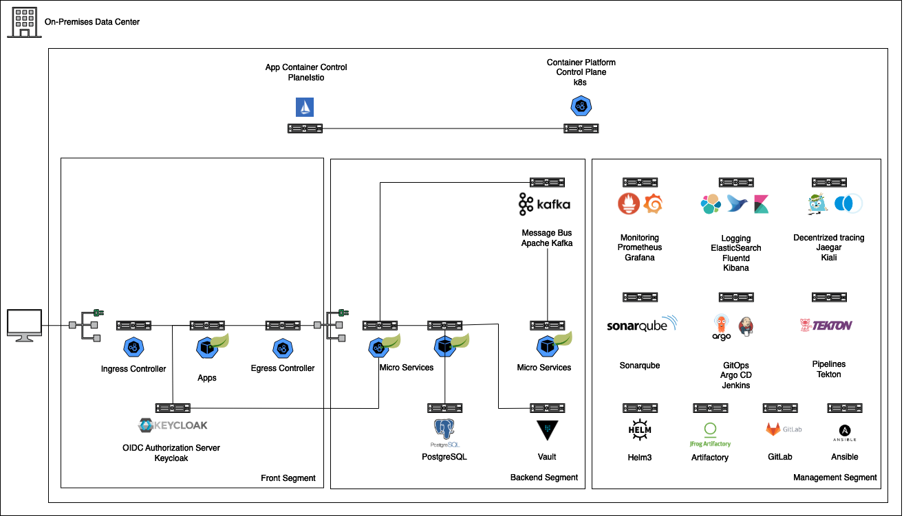

# PoC Micro Service on Kubernetes

## 1. [Set up RHEL EC2 instance on AWS](1-set-up-rhel-instance-on-aws.md)
## 2. [Set up MicroK8s](2-set-up-microk8s.md)
## 3. [Set up Application Environment](3-set-up-app-env.md)
## 4. [Implementation of Application](4-implementation-app.md)
## 5. [Deploy Application](5-deploy-app.md)
